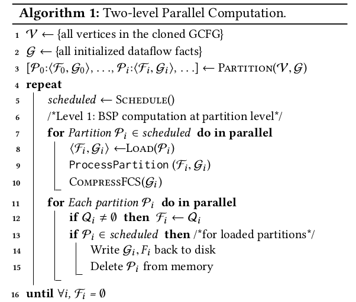

# Chianina

[toc]

This is the note of paper [Chianina: An Evolving Graph System for Flow- and Context-Sensitive Analyses of Million Lines of C Code](https://dl.acm.org/doi/pdf/10.1145/3453483.3454085).

## Background

Given an analysis algorithm — in its simplest form — can we run it efficiently over large programs without requiring any sophisticated treatment from developers?

This paper revisits the problem of scaling context- and flow-sensitive analyses from a system perspective — that is, we aim to develop system support for scaling the simplest versions of context- and flow-sensitive algorithms that developers can quickly implement by following interfaces. 

This paper presents a domain-specific graph system dubbed `Chianina`, that supports easy development of any context- and flow-sensitive analysis (with a monotone transfer function) for C and that is powerful enough to scale the analysis to many millions of lines of code.

## Basic Idea

Given a code snippet of program, `Chianina` would 

* use a 2-approximate cloning for context-sensitivity and generates a global CFG(GCFG).  

* divide the GCFG into multiple partitions. (For example, in Figure 1, the program is partitioned into 2 partitions)

* the `Chianina` scheduler picks a number of partitions at a time and loads them into memory for parallel computation. The parallel computation keeps **incrementally** updating program expression graph(PEG) and sending messages of the temporary PEG, until a fixed point is reached.

  

Figure 1: An example of partition

## Design & Implementation

### User's job

Users need to do two things to specify the analysis:

* specify her own graph implementation(such as PEG for pointer analysis) for dataflow facts.
* implements two functions: combine and transfer

### Parallel Algorithm

#### Overall

The BSP(bulk synchronous parallel) parallel algorithm is shown in Figure 2.

Figure 2: BSP parallel algorithm

In loop from line 5 to line 16, partitions scheduled to process are loaded and processed completely in parallel during each superstep.

Each partition $P_i$ has three data structures:

* $F_i$: the active CFG vertices that form the frontier for the partition
* $G_i$: the set of dataflow fact graphs
* $Q_i$: the message queue

From line 7 to line 10,  the partition-level BSP is done:

* line 8 loads $<F_i,G_i>$ of each $P_i$ into memory
* line 9 processes the partition
* line 10 finds and exploits frequent common subgraphs.

From line 11 to line 15, the synchronization phase is done, where the updated $G_i$ and $F_i$ are removed from memory and written back to disk.

#### Process Partition

Function `ProcessPartition` exploits parallelism at the CFG-vertex level(shown in Figure 3). 

Figure 3: process partition

The logic of dataflow analysis is done from line 20 to line 27. 

From line 29 to line 32, the result of a mirror vertex $s$ is sent to partition $P_j$ by message queue $Q_j$,  where $s$ belongs to $P_j$.

### Partitioning

`Chianina` uses the vertex-centric edge-cut strategy for effective partitioning.

Vertices of the global control flow graph are firstly divided into disjoint sets. A partition is then created by assigning all the edges whose source or destination vertex
belongs to this set. For edges that cross two partitions, `Chianina` creates mirror vertices and place the mirror edges into  $P_1$ and $P_2$, respectively.

### Scheduling

In order to reduce the communication costs, `Chianina` uses a priority queue to assign partitions with more active vertices a higher priority.

## Evaluation

`Chianina` does context- and flow- sensitive alias analysis, null value flow analysis and cache analysis on Linux, Firefox, PostgreSQL, openSSL and Httpd.

Here are the result:

1. The number of partitions for large programs such as Linux and Firefox is greater than 100, so we need large disk support for it. Also, it takes more than 20 hours to do analysis for Linux kernel but just several minutes for Httpd(As is shown in Figure 4).

   

   
Figure 4: overall performance

2. In memory computation takes up the majority(more than 80%) of time, since each iteration updates many PEGS and each PEG has many edges(As is shown in Figure 5).

   

   
Figure 5: breakdown performance

3. `Chianina` scales almost linearly with the number of threads, because cloning eliminates most of the data sharing between threads(As is shown in Figure 6).

   

   
Figure 6: thread scalability

4. The authors only compared the context-insensitive version of `Chianina` and other state-of-the-art program analysis applications. They found that `Chianina` is suitable for analyzing large applications without encountering `out of memory` error, `Chianina` may have more overhead for small applications(As shown in Figure 7).

   

Figure 7: Comparison with other program analysis application

5. The authors examined each pointer dereference expression in load and store statements of the program, and measured the average sizes of their alias sets
   weighted by the number of times each variable is dereferenced — the smaller the better. On Httpd and PostgreSQL, for which these three flow-sensitive analyses scale, they achieve almost the same average sizes, with a less than 0.5% variation, indirectly validating the correctness of our implementation.

## Conclusion

`Chianina` is a novel evolving graph system for scalable context- and flow-sensitive  analysis for C code. It is scalable and help simplify user's work on program analysis.

However, `Chianina` requires a pre-computed call graph for cloning, which is difficult for certain dynamic languages such as JavaScript. Moreover, adapting the work to a cloud setting is also worthy to further boost analysis scalability.