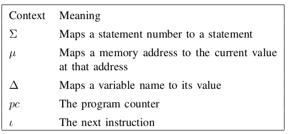
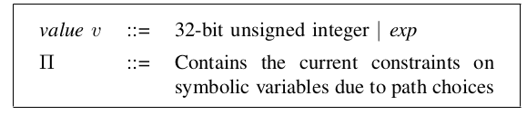

# Dynamic Taint Analysis and Forward Symbolic Execution

[toc]

## A General Language

### Overview

A simple intermediate language(`SIMPIL`), which is powerful enough to express typical languages such as Java and assembly code.


Statements in `SIMPIL` consist of assignments, assertions, jumps and conditional jumps.

### Execution context

$\Sigma$ is the list of program statements

$\mu$ is the current memory state

$\Delta$ is the current value for variables

$pc$ is the program counter

$l$ is the current statement



### Operational Semantics

Each statement rule is of the form of `propositional logic`:

```
            computation
------------------------------------  RULE TYPE
current state,stmt -> end state,stmt 
```

If the statement matches the `RULE TYPE`, then it does the `computation` and the state will transform.

We use $\mu, \Delta \vdash e \Downarrow v$ to evaluate an expression $e$ to a value $v$ in the current state given by $\mu$ and $\Delta$.

We use $\Delta' = \Delta[x \rightarrow 10]$ to set $x$ as 10 and get a new context.


For example,  consider the statement of

```
x = 2 * get_input();
```

We first use `CONST` rule and `INPUT` rule, 

Then we use `BINOP` rule and finally we use `ASSIGN` rule to finish.


### High-level semantics

We can deal with high-level semantics in two ways.

* We can compile the missing high-level language constructs down to `SIMPIL`.

  For example, we can compile function calls down to `SIMPIL` by storing the return address and transferring control flow.


* We can add high-level semantics into `SIMPIL` to enhance analysis.

  For example, the semantics of `CALL`, `RET` and `DYNAMICALLY GENERATED CODE` are shown below:

  


## Dynamic taint analysis

### Semantics

Since dynamic taint analysis is performed on code at runtime, it is natural to add dynamic taint analysis semantics.

To keep track of the taint status, we refines values in `SIMPIL` as $<v,\tau>$, where $v$ is a value in the initial language and $\tau$ is the taint status of $v$.  


So we can add policies to enable dynamic taint analysis in `SIMPIL`.


### Policy

#### Taint Introduction

It specifies how taint is introduced into a system.

We initialize all variables, memory cells as untainted.

In `SIMPIL`, we only have a single source of user input: `get_input()`

A taint policy will also distinguish between different input sources.

#### Taint Propagation

It specifies the taint status for data derived from tainted or untainted operands.

#### Taint Checking

In `SIMPIL`,we perform checking by adding the policy to the premise of the operational semantics. 

For example, `T-GOTO` rule uses $P_{gotocheck}(t)$ policy, which returns $T$ if it is safe to perform a jump operation when the target is safe to perform a jump operation when the target address has taint value $t$.

### A Typical Taint Policy

`Tainted Jump Policy`, which aims to protect a potentially vulnerable program from control flow hijacking attacks.

The main idea is that an input-derived value will never overwrite a control-flow value such as a return address or function pointer.


This policy introduces taint into the system by marking all values returned by `get_input()` as tainted.

To fix the problem of undertainting address injection, we can use `Tainted Address Policy`, where a memory cell is tainted if either the value or address is tainted.


### Control-flow Taint

Unfortunately, pure dynamic taint analysis cannot compute control dependencies, because reasoning about control dependencies requires reasoning about multiple paths, and dynamic analysis executes on a single path at a time.

### Sanitization

`Taint Sanitization Problem` identifies when taint can be removed from a value.

For example, we want to know when the program computes constant functions(e.g. if $b = a \oplus a$, then $b = 0$ regardless of $a$)


## Forward Symbolic Execution

We can reduce the reasoning about the behavior of the program to the domain of logic.

### Applications and Advantages

#### Multiple inputs

It can be used to reason about more than one input class at once.

### Semantics of Forward Symbolic Execution

When `get_input()` is evaluated symbolically, it returns a `symbol` instead of a `concrete value`.

When a new `symbol` returns, there is no constrain on it.

So `SIMPIL` should be modified as



Branches constrain the values of symbolic variables to the set of values that would execute the path, and the updated semantics is shown below:


### Symbolic Memory Addresses

In `LOAD` and `STORE` rules, it uses a integer value to reference a particular memory cell.

The `Symbolic Memory Address` problem arises whenever an address referenced in a `LOAD` or a `STORE` operation is an expression instead of a concrete value.

* Load: a sound strategy is to consider it a load from any possible satisfying assignment for the expression.

* Store: a store could overwrite any value for a satisfying assignment to the expression.

Also, symbolic memory addresses can lead to `aliasing` issues.

There are several ways to deal with symbolic reference:

* Make unsound assumptions: transform the address cell as variables.
* Let subsequent analysis deal with them.(We may use `SMT` solver to reason about the aliasing problem)

* perform alias analysis

### Path Selection

When Forward Symbolic Execution encounters a branch, it must decide which branch to follow first.

It can be viewed as a tree-search problem. The analysis begins with only a root node in the tree. Then it add the forked states as children to the current node.

Forward Symbolic execution needs a strategy for choosing which state to explore next(e.g. `DFS`, `Concolic Testing`, `Random Paths` and `Heuristics`).

### Symbolics Jumps

The jump target may be an expression instead of a concrete location.

### Handling System and Library Calls

Some system-level calls introduce fresh symbolic variables and also have additional side effects.

* We can create summaries to describe the side effect
* Concolic execution to use values returned from system calls on previous concrete execution

### Performance

A straightforward implementation of forward symbolic execution has 

* $T = O(2^b)$, where $T$ is the running time and $b$ is the number of program branches

* $f = O(2^n)$, where $f$ is the number of formulas and $n$ is the number of program line
* an exponentially-sized formula per branch

So we can mitigate the problems in three ways:

* Exploiting parallelism
* Giving each variable assignment a unique name
* Eliminating the redundancies between formulas

### Mixed Execution

Allowing some inputs to be concrete and others symbolic is called `mixed execution`.

