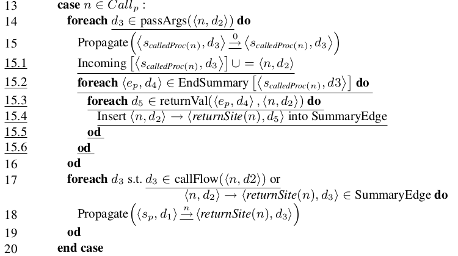

# FlowDroid source code analysis

[toc]

The source code of FlowDroid is cloned from [here](https://github.com/secure-software-engineering/FlowDroid).

## MainClass

The class `MainClass` of `soot.sjimple.infoflow.cmd`

In method `run()`:

* Initialize the parameters

  ```java
  initializeCommandLineOptions();
  ```

* Parse the command-line parameters and options

  ```java
  CommandLine cmd = parser.parse(options, args);
  parseCommandLineOptions(cmd, config);
  ```

* Get the target `APK`s

  ```java
  File targetFile = new File(config.getAnalysisFileConfig().getTargetAPKFile());
  List<File> apksToAnalyze;
  ```

* Get the output files

  ```java
  outputFileStr = config.getAnalysisFileConfig().getOutputFile();
  ```

* Initialize the `taint wrapper`

  ```java
  ITaintPropagationWrapper taintWrapper = initializeTaintWrapper(cmd);
  ```

  See [TaintWrapper](#itaintpropagationwrapper) below

* Configure the analyzer for current `APK` file.

  Construct the `SetupApplication` by calling `createFlowDroidInstance()`.

  ```java
  analyzer = createFlowDroidInstance(config);
  analyzer.setTaintWrapper(taintWrapper);
  ```

* Start the dataflow analysis

  ```java
  analyzer.runInfoflow();
  ```

  See [runInfoflow](#runinfoflow()) below

## ITaintPropagationWrapper

This **interface** declares methods to define classes and methods which should not be analyzed directly. Analysis results are instead taken from an external model containing method summaries. 

This one can enhance the efficiency of analysis.

Here is the important function: 

* `initializeTaintWrapper`: a function out of the interface,  which initializes the taint wrapper based on the command-line parameters

  ```java
  private ITaintPropagationWrapper initializeTaintWrapper(CommandLine cmd) throws Exception;
  ```

  * it gets the definition files for the taint wrapper.

    ```java
    String[] definitionFiles = cmd.getOptionValues(OPTION_TAINT_WRAPPER_FILE);
    ```

  * get the option of taint wrapper

    ```java
    String taintWrapper = cmd.getOptionValue(OPTION_TAINT_WRAPPER);
    ```

  * construct `ITaintPropagationWrapper`

    ```java
    result = createSummaryTaintWrapper(cmd, new LazySummaryProvider("summariesManual"));
    ```


## SetupApplication

The class to configure the dataflow analyzer.

### Attributes

* `logger`: for logging
* `sourceSinkProvider`: to provide source and sink
* `callbackMethods`:
* `entrypoints`:
* `collectedSources`:
* `collectedSinks`:
* `taintPropagationHandler`:
* `backwardsPropagationHandler`:
* ...

### Methods

#### runInfoflow()

```java
public InfoflowResults runInfoflow() throws IOException, XmlPullParserException;
```

runs the dataflow analysis.

* gets `sourceSinkFile`.

  ```java
  String sourceSinkFile = config.getAnalysisFileConfig().getSourceSinkFile();
  ```

* gets `parser` as a `source` and `sink` set provider, based on different format of `sourceSinkFile`

  ```java
  ISourceSinkDefinitionProvider parser = PermissionMethodParser.fromFile(sourceSinkFile)
  ```

* calls another `runInfoflow`

  ```java
  return runInfoflow(parser);
  ```

  See [another runInfoflow](#runinfoflow(sourcesandsinks)) below.

#### runInfoflow(sourcesAndSinks)

```java
public InfoflowResults runInfoflow(ISourceSinkDefinitionProvider sourcesAndSinks);
```

runs the dataflow analysis

* resets our object state by the `config` and `sourcesAndSinks`.

  * build `collectedSources` to collect all of the sources.
  * build `collectedSinks` to collect all of the sinks.
  * build `sourceSinkProvider` to get sources and sinks.

  ```java
  this.collectedSources = config.getLogSourcesAndSinks() ? new HashSet<Stmt>() : null;
  this.collectedSinks = config.getLogSourcesAndSinks() ? new HashSet<Stmt>() : null;
  this.sourceSinkProvider = sourcesAndSinks;
  this.infoflow = null;
  ```

* starts a new `Soot` instance

  ```java
  // Start a new Soot instance
  if (config.getSootIntegrationMode() == SootIntegrationMode.CreateNewInstace) {
  	G.reset();
  	initializeSoot();
  }
  ```

* parse the resource of the App

  ```java
  parseAppResources();
  ```

  See [parseAppResources](#parseappresources) below.

* process and analyze each entry point.

  ```java
  processEntryPoint(sourcesAndSinks, resultAggregator, -1, null);
  ```

  See [processEntryPoint](#processentrypoint) below.

#### initializeSoot()

Initializes soot for running the soot-based phases of the application.

```java
private void initializeSoot();
```

* clean up old `Soot` instance.

  ```java
  G.reset();
  ```

* get `androidJar` and `apkFileLocation` and set the options

  ```java
  Options.v().set_xxx
  ```

* call `configureCallgraph`

  ```java
  configureCallgraph();
  ```

  which configures the callgraph options for `Soot` according to `FlowDroid`'s callgraph algorithm.

#### parseAppResources()

parse the app resources

* get the `apk` file to analyze

  ```java
  final File targetAPK = new File(config.getAnalysisFileConfig().getTargetAPKFile());
  ```

* parse the resource file

  ```java
  this.resources.parse(targetAPK.getAbsolutePath());
  ```

* get the `manifest` file of the App

  ```java
  this.manifest = new ProcessManifest(targetAPK, resources);
  ```

* add the name of nodes of `activity`, `provider`, `service`, `receiver` into `entryPoints`

  ```java
  Set<String> entryPoints = manifest.getEntryPointClasses();
  ```

* add unsafe Soot Class according to the name(signature) in `entryPoints`.

  ```java
  for (String className : entryPoints) {
  	SootClass sc = Scene.v().getSootClassUnsafe(className);
  	if (sc != null)
  		this.entrypoints.add(sc);
  }
  ```

#### processEntryPoint

runs the dataflow analysis on the given entry point class.

```java
protected void processEntryPoint(ISourceSinkDefinitionProvider sourcesAndSinks,
	MultiRunResultAggregator resultAggregator, int numEntryPoints, SootClass entrypoint);
```

* calculate callback functions

  ```java
  calculateCallbacks(sourcesAndSinks);
  ```

  * calls `calculateCallbackMethods(lfp, entryPoint)` , to calculate the set of callback methods declared in the XML resource files or the app's source code. 

    * Inside it, it calls `releaseCallgraph()`, `releasePointsToAnalysis()`  and  `releaseReachableMethods()` to change the configuration options.

    * It also collects the callback interfaces implemented in the app's source code. 

      ```java
      jimpleClass.addCallbackFilter(new AlienHostComponentFilter(entrypoints));
      jimpleClass.addCallbackFilter(new ApplicationCallbackFilter(entrypoints));
      jimpleClass.addCallbackFilter(new UnreachableConstructorFilter());
      jimpleClass.collectCallbackMethods();
      ```

    * parse the layout XML files in the given `APK` file.

      ```java
      lfp.parseLayoutFile(config.getAnalysisFileConfig().getTargetAPKFile());
      ```

    * Iterate: 

      in each loop, creates the main method based on the current callback information.

      ```java
      while(hasChanged) {
      	hasChanged = false;
      	createMainMethod(component);
          constructCallgraphInternal();
      ```

* create and run the dataflow tracker

  ```java
  infoflow = createInfoflow();
  ```

* run analysis

  ```java
  infoflow.runAnalysis(sourceSinkManager, entryPointCreator.getGeneratedMainMethod());
  ```

  See [runAnalysis](#runanalysis) below.

* print out the found result

#### runAnalysis

calls this `runAnalysis` to conduct a taint analysis on an already initialized callgraph.

```java
private void runAnalysis(final ISourceSinkManager sourcesSinks, final Set<String> additionalSeeds);
```

* check and fix configuration of dataflow server.

  ```java
  checkAndFixConfiguration();
  ```

* print the configuration to log

  ```java
  config.printSummary();
  ```

* initialize the abstraction configuration

  ```java
  Abstraction.initialize(config);
  ```

* build the callgraph

  ```java
  constructCallgraph();
  ```

  * patch the system libraries we need for callgraph construction.

    ```java
    patcher.patchLibraries();
    ```

  * set the resolving level and phantom class for each `SootClass`

    ```java
    for (SootClass sc : Scene.v().getClasses())
    	if (sc.resolvingLevel() == SootClass.DANGLING) {
    		sc.setResolvingLevel(SootClass.BODIES);
    		sc.setPhantomClass();
    	}
    ```

  * set the packs and build the callgraph

    ```java
    PackManager.v().getPack("wjpp").apply();
    PackManager.v().getPack("cg").apply();
    ```

* initialize the source and sink manager(I don't know why the number of selected sources and sinks are fewer than that I put in `SourcesAndSinks.txt`)

  ```java
  sourcesSinks.initialize();
  ```

* dead code elimination

  ```java
  eliminateDeadCode(sourcesSinks);
  ```

* build `ICFG`(interprocedural control flow graph)

  ```java
  buildBiDirICFG();
  ```

  In this method, it firstly gets the `baseCFG`, and then it gets the `iCFG`.

* initialize the dataflow manager

  ```java
  manager = initializeInfoflowManager(sourcesSinks, iCfg, globalTaintManager);
  ```

* initialize the `alias` analysis and the `backwardSolver`.

  ```java
  Abstraction zeroValue = null;
  IAliasingStrategy aliasingStrategy = createAliasAnalysis(sourcesSinks, iCfg, executor, memoryManager);
  IInfoflowSolver backwardSolver = aliasingStrategy.getSolver();
  if (backwardSolver != null) {
  	zeroValue = backwardSolver.getTabulationProblem().createZeroValue();
  	solvers.add(backwardSolver);
  }
  ```

  As we can see, it gets the `backwardSolver`, which contains `icfg`, `flowFunctions` and so on.

* initialize the aliasing infrastructure

  ```java
  Aliasing aliasing = createAliasController(aliasingStrategy);
  manager.setAliasing(aliasing);
  ```

* initialize the dataflow problem

  ```java
  InfoflowProblem forwardProblem = new InfoflowProblem(manager, zeroValue, ruleManagerFactory);
  ```

* create the forward dataflow solver

  ```java
  IInfoflowSolver forwardSolver = createForwardSolver(executor, forwardProblem);
  ```

* looking for sources and sinks

  ```java
  for (SootMethod sm : getMethodsForSeeds(iCfg))
  	sinkCount += scanMethodForSourcesSinks(sourcesSinks, forwardProblem, sm);
  ```

  if it has not found a source or sink, then the solver terminates.

* create the path builder

  ```java
  final IAbstractionPathBuilder builder = new BatchPathBuilder(manager, pathBuilderFactory.createPathBuilder(manager, resultExecutor));
  ```

* **run `solve` for `forwardSolver` (MARK! MARK! THIS IS THE ENTRY POINT OF `IFDS` ALGORITHM)** 

  ```java
  forwardSolver.solve();
  ```

  It calls `submitInitialSeeds` to schedule the processing of initial seeds to initialize the analysis.

  ```java
  submitInitialSeeds()
  ```

  In method `submitInitialSeeds()`,  `initialSeeds` means the set of `<entry_node, domain>`.

  For each value in the domain of the entry node, it calls `propagate()`.

  Then, it calls `addFunction()` to add the new path edge.

  ```java
  	/**
  	 * Schedules the processing of initial seeds, initiating the analysis. Clients
  	 * should only call this methods if performing synchronization on their own.
  	 * Normally, {@link #solve()} should be called instead.
  	 */
  	protected void submitInitialSeeds() {
  		for (Entry<N, Set<D>> seed : initialSeeds.entrySet()) {
  			N startPoint = seed.getKey();
  			for (D val : seed.getValue())
  				propagate(zeroValue, startPoint, val, null, false);
  			addFunction(new PathEdge<N, D>(zeroValue, startPoint, zeroValue));
  		}
  	}
  ```

   `propagate(D sourceVal, N target, D targetVal, N relatedCallSite, boolean isUnbalancedReturn) `

  ```java
  	/**
  	 * Propagates the flow further down the exploded super graph.
  	 * 
  	 * @param sourceVal          the source value of the propagated summary edge
  	 * @param target             the target statement
  	 * @param targetVal          the target value at the target statement
  	 * @param relatedCallSite    for call and return flows the related call
  	 *                           statement, <code>null</code> otherwise (this value
  	 *                           is not used within this implementation but may be
  	 *                           useful for subclasses of {@link IFDSSolver})
  	 * @param isUnbalancedReturn <code>true</code> if this edge is propagating an
  	 *                           unbalanced return (this value is not used within
  	 *                           this implementation but may be useful for
  	 *                           subclasses of {@link IFDSSolver})
  	 */
  	protected void propagate(D sourceVal, N target, D targetVal,
  			/* deliberately exposed to clients */ N relatedCallSite,
  			/* deliberately exposed to clients */ boolean isUnbalancedReturn) {
  		...
  		final PathEdge<N, D> edge = new PathEdge<N, D>(sourceVal, target, targetVal);
  		...
          scheduleEdgeProcessing(edge);
  	}
  ```

  In `propagate()`, it first generates a summary edge `edge` based on the `sourceVal`, `target` and `targetVal`.

  Then, it calls `scheduleEdgeProcessing(edge)` to propagate the summary edge.

  ```java
  	/**
  	 * Dispatch the processing of a given edge. It may be executed in a different
  	 * thread.
  	 * 
  	 * @param edge the edge to process
  	 */
  	protected void scheduleEdgeProcessing(PathEdge<N, D> edge) {
  		// If the executor has been killed, there is little point
  		// in submitting new tasks
  		if (killFlag != null || executor.isTerminating() || executor.isTerminated())
  			return;
  
  		executor.execute(new PathEdgeProcessingTask(edge, solverId));
  		propagationCount++;
  	}
  ```

  In the method of `scheduleEdgeProcessing`, it creates a new `PathEdgeProcessingTask`, then it stores this task into the thread pool, and it runs the thread by calling `executor.execute()`. Then, it continuously calls `super.execute()` until calling `public void execute(Runnable command)` in `ThreadPoolExecutor.java`, which will execute the thread and call method `public void run()` in `IFDSSolver.java`, which is like

  ```java
  public void run() {
  	if (icfg.isCallStmt(edge.getTarget())) {
  		processCall(edge);
  	} else {
  		// note that some statements, such as "throw" may be
  		// both an exit statement and a "normal" statement
  		if (icfg.isExitStmt(edge.getTarget()))
  			processExit(edge);
  		if (!icfg.getSuccsOf(edge.getTarget()).isEmpty())
  			processNormalFlow(edge);
  	}
  }
  ```
  
  As we can see,  given the `icfg` as the environment and the `edge`(`dSource`, `dTarget` and `Target`), we can execute the `IFDS` algorithm described in the paper: `Practical Extensions to the IFDS Algorithm`. Here we see those methods below:
  
* ### processCall(edge)

  ```java
  private void processCall(PathEdge<N, D> edge)
  ```

  Parameter `edge` is a tuple of `<d1,n,d2>` which represents the edge of `<sp,d1>` $\rightarrow$ `<n,d2>`. Here, `n` is a node representing a call site; `sp` is a node representing the start point of source; `d1` and `d2` are the correspoding dataflow facts.

  This method implements the `tabulation algorithm` from line 13 to line 20, which processes call flow

  

  In a figure, it is like this( $n$ is a node representing a call site)

  ```
  <Sp,d1>
     |
  <n,d2>
          \
             <Scp(n),d3>
                  |  
             <Ecp(n),d4>
          /
  <rs(n),d5>
  ```

  And This is what this algorithm does

  1. line 15 propagates $<S_{cp(n)},d_3> \rightarrow <S_{cp(n)},d_3>$.

  2. line 15.1 adds $<n,d_2>$ as the predecessor of $<S_{cp(n)},d_3>$.

  3. line 15.4 adds the summary edge of $<n,d_2> \rightarrow <rs(n),d_5>$.

  4. line 18 propagates $<n,d_2> \rightarrow <rs(n),d_5>$.

  

  So the **implementation** of `processCall(edge)` is

  * Firstly, it gets the possible callees

    ```java
    Collection<SootMethod> callees = icfg.getCalleesOfCallAt(n);
    ```

  * Then, it filters the methods with concrete body

    ```java
    callees.stream().filter(m -> m.isConcrete()).forEach({ 	
        public void accept(SootMethod sCalledProcN) {}
    })
    ```

  * For the method with a concrete body, it calls `accept()` to explore this new method and insert to summary edge(if possible).**(corresponding to line 15-15.6)**

    ```java
    // compute the call-flow function
    FlowFunction<D> function = flowFunctions.getCallFlowFunction(n, sCalledProcN);
    Set<D> res = computeCallFlowFunction(function, d1, d2);
    
    Collection<N> startPointsOf = icfg.getStartPointsOf(sCalledProcN);
    // for each result node of the call-flow function
    for (D d3 : res) {
    	// for each callee's start point(s)
    	for (N sP : startPointsOf) {
    		// create initial self-loop
    		propagate(d3, sP, d3, n, false); // line 15
    	}
        // register the fact that <sp,d3> has an incoming edge from
    	// <n,d2>
    	// line 15.1 of Naeem/Lhotak/Rodriguez
    	if (!addIncoming(sCalledProcN, d3, n, d1, d2))
    		continue;
    	// line 15.2,15.3,15.4
    	applyEndSummaryOnCall(d1, n, d2, returnSiteNs, sCalledProcN, d3);
    ```

    * It first computes the dataflow fact `d3` at the startpoint of the callee.

    * Then it calls `propagate(d3, sP, d3, n, false)` to propagate `<d3,sP,d3>`(which represents $<s_P,d_3> \rightarrow <s_P,d_3>$) **(corresponding to line 15)**

    * Then it calls ` addIncoming(sCalledProcN, d3, n, d1, d2)` to add $<n,d_2>$ into $Incoming[<sCalledProcN,d_3>]$. **(corresponding to line 15.1)**

    * At last, it calls `applyEndSummaryOnCall(d1, n, d2, returnSiteNs, sCalledProcN, d3)` to insert the summary edge, where we have

      ```java
      D d5p = d5;
      ...
      if (d5p != d2) {
      	d5p = d5p.clone();
      	d5p.setPredecessor(d2);
      }
      ```

       **(corresponding to line 15.4)**

  * At last, it calls `propagate(d1, returnSiteN, d3, n, false)` to propagate `<d1,returnSiteN,d3>`, which represents $<s_P,d_1> \rightarrow <returnSiteN,d_3>$ **(corresponding to line 18)**.

    ```java
    // line 17-19 of Naeem/Lhotak/Rodriguez
    // process intra-procedural flows along call-to-return flow functions
    for (N returnSiteN : returnSiteNs) {
    	FlowFunction<D> callToReturnFlowFunction = flowFunctions.getCallToReturnFlowFunction(n, returnSiteN);
    	Set<D> res = computeCallToReturnFlowFunction(callToReturnFlowFunction, d1, d2);
    
    	if (res != null && !res.isEmpty()) {
    		for (D d3 : res) {
    			if (memoryManager != null)
    				d3 = memoryManager.handleGeneratedMemoryObject(d2, d3);
    			if (d3 != null)
                    ////////////////////////////////////////
                    //              line 18               //
                    ////////////////////////////////////////
    				propagate(d1, returnSiteN, d3, n, false);
    		}
    	}
    }
    ```

    

* ### processExit(edge)

  ```java
  protected void processExit(PathEdge<N, D> edge)
  ```

  Parameter `edge` is a tuple of `<d1,n,d2>` which represents the edge of `<sp,d1>` $\rightarrow$ `<n,d2>`. Here, `n` is a node representing a exit node; `sp` is a node representing the start point of source; `d1` and `d2` are the correspoding dataflow facts.

  Here, the method `processExit(edge)` implements line 21-32 in the tabulation algorithm

  

  In a figure, it is like this($n$ is a node representing an exit point)

  ```
  <Sp(c),d3>
   |
  <c,d4>
         \ 
             <Sp(n),d1>
               |           
             <n,d2>
         /
  <rs(n),d5>
  ```

  And This is what this algorithm does

  1. line 21.1 adds $<n,d_2>$ into $EndSummary[<S_{p(n)},d_1>]$.

  2. line 25 adds the summary edge of $<c,d_4> \rightarrow <rs(c),d_5>$.

  3. line 27 propagates $<S_{p(c)},d_3> \rightarrow <rs(c),d_5>$.

  So the **implementation** of `processCall(edge)` is

  * add to `EndSummary`**(corresponding to line 21.1)**

    ```java
    addEndSummary(methodThatNeedsSummary, d1, n, d2);
    ```

  * add the `SummaryEdge`

    ```java
    D d5p = d5;
    switch (shorteningMode) {
    	case AlwaysShorten:
    		if (d5p != predVal) {
    			d5p = d5p.clone();
    			d5p.setPredecessor(predVal);
    		}
    		break;
    	case ShortenIfEqual:
    		if (d5.equals(predVal))
    			d5p = predVal;
    		break;
    }
    ```

  * propagates **???** why d4??

    ```java
    propagate(d4, retSiteC, d5p, c, false);
    ```

    

* ### processNormalFlow(edge)

  ```java
  private void processNormalFlow(PathEdge<N, D> edge) 
  ```

  Parameter `edge` is a tuple of `<d1,n,d2>` which represents the edge of `<sp,d1>` $\rightarrow$ `<n,d2>`. Here, `n` is a node except call site and return node; `sp` is a node representing the start point of source; `d1` and `d2` are the correspoding dataflow facts.

  Here, the method `processExit(edge)` implements line 33-38 in the tabulation algorithm

  

  In a figure, it is like this($n$ is a node except a call node and an exit node)

  ```
  <Sp,d1>
     |
  <n,d2>
     |
  <m,d3>
  ```

  And This is what this algorithm does

  1. line 35 propagates $<S_p,d_1> \rightarrow <m,d_3>$.

  So the **implementation** of `processNormalFlow(edge)` is

  * propagate

    ```java
    propagate(d1, m, d3, null, false);
    ```


## Result

I test `FlowDroid` on an simple `apk` file, and the result is shown below:

```
[main] INFO soot.jimple.infoflow.cmd.MainClass - Analyzing app /home/eddie/Desktop/summer_intern/FlowDroidHacking/FlowDroid/DroidBench/apk/GeneralJava/Clone1.apk (1 of 1)...
[main] INFO soot.jimple.infoflow.android.SetupApplication - Initializing Soot...
[main] INFO soot.jimple.infoflow.android.SetupApplication - Loading dex files...
[main] INFO soot.jimple.infoflow.android.SetupApplication - ARSC file parsing took 0.029009645 seconds
[main] INFO soot.jimple.infoflow.memory.MemoryWarningSystem - Registered a memory warning system for 1,177.2 MiB
[main] INFO soot.jimple.infoflow.android.entryPointCreators.AndroidEntryPointCreator - Creating Android entry point for 1 components...
[main] INFO soot.jimple.infoflow.android.SetupApplication - Constructing the callgraph...
[main] INFO soot.jimple.infoflow.android.callbacks.DefaultCallbackAnalyzer - Collecting callbacks in DEFAULT mode...
[main] INFO soot.jimple.infoflow.android.callbacks.DefaultCallbackAnalyzer - Callback analysis done.
[main] INFO soot.jimple.infoflow.android.entryPointCreators.AndroidEntryPointCreator - Creating Android entry point for 1 components...
[main] INFO soot.jimple.infoflow.android.SetupApplication - Constructing the callgraph...
[main] INFO soot.jimple.infoflow.android.callbacks.DefaultCallbackAnalyzer - Running incremental callback analysis for 1 components...
[main] INFO soot.jimple.infoflow.android.callbacks.DefaultCallbackAnalyzer - Incremental callback analysis done.
[main] INFO soot.jimple.infoflow.memory.MemoryWarningSystem - Shutting down the memory warning system...
[main] INFO soot.jimple.infoflow.android.SetupApplication - Callback analysis terminated normally
[main] INFO soot.jimple.infoflow.android.SetupApplication - Entry point calculation done.
[main] WARN soot.jimple.infoflow.android.data.parsers.PermissionMethodParser - Line does not match: <org.springframework.web.servlet.tags.UrlTag: java.lang.String createUrl)> -> _SINK_
[main] WARN soot.jimple.infoflow.android.data.parsers.PermissionMethodParser - Line does not match: <org.springframework.orm.hibernate3.support.ClobStringType: int[] sqlTypes)> -> _SINK_
[main] WARN soot.jimple.infoflow.android.data.parsers.PermissionMethodParser - Line does not match: <org.springframework.security.config.http.CsrfBeanDefinitionParser: org.springframework.beans.factory.config.BeanDefinition getCsrfLogoutHandler)> -> _SOURCE_
[main] WARN soot.jimple.infoflow.android.data.parsers.PermissionMethodParser - Line does not match: <java.io.File: java.io.File getAbsoluteFile)> -> _SOURCE_
[main] WARN soot.jimple.infoflow.android.data.parsers.PermissionMethodParser - Line does not match: <org.springframework.security.config.http.FormLoginBeanDefinitionParser: java.lang.String getLoginPage)> -> _SOURCE_
[main] WARN soot.jimple.infoflow.android.data.parsers.PermissionMethodParser - Line does not match: <com.google.auth.oauth2.UserCredentials: java.lang.String getClientSecret)> -> _SOURCE_
[main] WARN soot.jimple.infoflow.android.data.parsers.PermissionMethodParser - Line does not match: <org.springframework.web.servlet.tags.UrlTag: java.lang.String createUrl)> -> _SOURCE_
[main] WARN soot.jimple.infoflow.android.data.parsers.PermissionMethodParser - Line does not match: <java.io.File: java.io.File getCanonicalFile)> -> _SOURCE_
[main] WARN soot.jimple.infoflow.android.data.parsers.PermissionMethodParser - Line does not match: <org.apache.xmlrpc.webserver.RequestData: java.lang.String getMethod)> -> _SOURCE_
[main] WARN soot.jimple.infoflow.android.data.parsers.PermissionMethodParser - Line does not match: <org.dmfs.oauth2.client.http.requests.ResourceOwnerPasswordTokenRequest: org.dmfs.httpclient.HttpRequestEntity requestEntity)> -> _SOURCE_
[main] WARN soot.jimple.infoflow.android.data.parsers.PermissionMethodParser - Line does not match: <org.springframework.security.concurrent.DelegatingSecurityContextExecutorService: java.util.concurrent.ExecutorService getDelegate)> -> _SOURCE_
[main] WARN soot.jimple.infoflow.android.data.parsers.PermissionMethodParser - Line does not match: <org.springframework.security.config.annotation.web.builders.HttpSecurity: org.springframework.security.config.'annotation'.web.configurers.HeadersConfigurer headers)> -> _SOURCE_
[main] WARN soot.jimple.infoflow.android.data.parsers.PermissionMethodParser - Line does not match: <org.springframework.web.servlet.tags.EscapeBodyTag: java.lang.String readBodyContent)> -> _SOURCE_
[main] WARN soot.jimple.infoflow.android.data.parsers.PermissionMethodParser - Line does not match: <org.springframework.security.config.http.FormLoginBeanDefinitionParser: java.lang.String getLoginProcessingUrl)> -> _SOURCE_
[main] WARN soot.jimple.infoflow.android.data.parsers.PermissionMethodParser - Line does not match: <org.springframework.security.config.annotation.web.configurers.LogoutConfigurer: java.util.List getLogoutHandlers)> -> _SOURCE_
[main] WARN soot.jimple.infoflow.android.data.parsers.PermissionMethodParser - Line does not match: <org.apache.xmlrpc.webserver.RequestData: java.lang.String getHttpVersion)> -> _SOURCE_
[main] WARN soot.jimple.infoflow.android.data.parsers.PermissionMethodParser - Line does not match: <com.google.auth.oauth2.DefaultCredentialsProvider: java.io.File getWellKnownCredentialsFile)> -> _SOURCE_
[main] WARN soot.jimple.infoflow.android.data.parsers.PermissionMethodParser - Line does not match: <org.apache.xmlrpc.webserver.HttpServletRequestImpl: void parseParameters)> -> _SOURCE_
[main] WARN soot.jimple.infoflow.android.data.parsers.PermissionMethodParser - Line does not match:     
[main] INFO soot.jimple.infoflow.android.source.AccessPathBasedSourceSinkManager - Created a SourceSinkManager with 68 sources, 194 sinks, and 1 callback methods.
[main] INFO soot.jimple.infoflow.android.SetupApplication - Collecting callbacks and building a callgraph took 0 seconds
[main] INFO soot.jimple.infoflow.android.SetupApplication - Running data flow analysis on /home/eddie/Desktop/summer_intern/FlowDroidHacking/FlowDroid/DroidBench/apk/GeneralJava/Clone1.apk with 68 sources and 194 sinks...
[main] INFO soot.jimple.infoflow.InfoflowConfiguration - Implicit flow tracking is NOT enabled
[main] INFO soot.jimple.infoflow.InfoflowConfiguration - Exceptional flow tracking is enabled
[main] INFO soot.jimple.infoflow.InfoflowConfiguration - Running with a maximum access path length of 5
[main] INFO soot.jimple.infoflow.InfoflowConfiguration - Using path-agnostic result collection
[main] INFO soot.jimple.infoflow.InfoflowConfiguration - Recursive access path shortening is enabled
[main] INFO soot.jimple.infoflow.InfoflowConfiguration - Taint analysis enabled: true
[main] INFO soot.jimple.infoflow.InfoflowConfiguration - Using alias algorithm FlowSensitive
[main] INFO soot.jimple.infoflow.memory.MemoryWarningSystem - Registered a memory warning system for 1,177.2 MiB
[main] INFO soot.jimple.infoflow.android.SetupApplication$InPlaceInfoflow - Callgraph construction took 0 seconds
[main] INFO soot.jimple.infoflow.codeOptimization.InterproceduralConstantValuePropagator - Removing side-effect free methods is disabled
[main] INFO soot.jimple.infoflow.android.SetupApplication$InPlaceInfoflow - Dead code elimination took 0.020726056 seconds
[main] INFO soot.jimple.infoflow.android.SetupApplication$InPlaceInfoflow - Callgraph has 13 edges
[main] INFO soot.jimple.infoflow.android.SetupApplication$InPlaceInfoflow - Starting Taint Analysis
[main] INFO soot.jimple.infoflow.android.SetupApplication$InPlaceInfoflow - Using context- and flow-sensitive solver
[main] INFO soot.jimple.infoflow.android.SetupApplication$InPlaceInfoflow - Using context- and flow-sensitive solver
[main] WARN soot.jimple.infoflow.android.SetupApplication$InPlaceInfoflow - Running with limited join point abstractions can break context-sensitive path builders
[main] INFO soot.jimple.infoflow.android.SetupApplication$InPlaceInfoflow - Looking for sources and sinks...
[main] INFO soot.jimple.infoflow.android.SetupApplication$InPlaceInfoflow - Source lookup done, found 1 sources and 1 sinks.
[main] INFO soot.jimple.infoflow.android.SetupApplication$InPlaceInfoflow - Taint wrapper hits: 4
[main] INFO soot.jimple.infoflow.android.SetupApplication$InPlaceInfoflow - Taint wrapper misses: 3
[main] INFO soot.jimple.infoflow.android.SetupApplication$InPlaceInfoflow - IFDS problem with 12 forward and 2 backward edges solved in 2 seconds, processing 0 results...
[main] INFO soot.jimple.infoflow.android.SetupApplication$InPlaceInfoflow - Current memory consumption: 46 MB
[main] INFO soot.jimple.infoflow.android.SetupApplication$InPlaceInfoflow - Memory consumption after cleanup: 20 MB
[main] INFO soot.jimple.infoflow.memory.MemoryWarningSystem - Shutting down the memory warning system...
[main] INFO soot.jimple.infoflow.android.SetupApplication$InPlaceInfoflow - Memory consumption after path building: 19 MB
[main] INFO soot.jimple.infoflow.android.SetupApplication$InPlaceInfoflow - Path reconstruction took 0 seconds
[main] WARN soot.jimple.infoflow.android.SetupApplication$InPlaceInfoflow - No results found.
[main] INFO soot.jimple.infoflow.android.SetupApplication$InPlaceInfoflow - Data flow solver took 3 seconds. Maximum memory consumption: 46 MB
[main] INFO soot.jimple.infoflow.android.SetupApplication - Found 0 leaks
```

