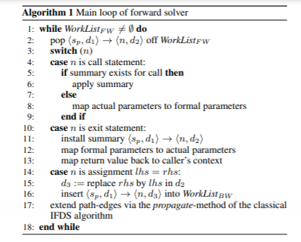
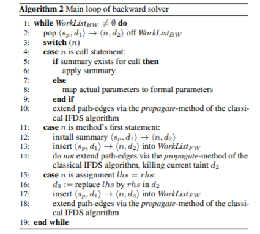

# Flowdroid

[toc]

## Introduction

### Challenge:

* model the lifecycle.
* integrate further callbacks for system event handling.
* The API calls to return the sensitive information cannot be detected based on the program code alone.(Their detection requires a model of auxiliary information stored in the manifest and layout XML files)
* Android Apps also contains aliasing and virtual dispatch constructs.

### Overall features

Flowdroid is the first static taint-analysis system that is fully context, flow, field and object-sensitive while precisely modeling the complete Android lifecycle.

### Background

To avoid `false negatives`, a taint analysis must model the App lifecycle correctly, recognizing that a user may indeed hit the button after an App has restarted.

To avoid `false positive`, the analysis must be `field-sensitive`.

### Attacker model

typically, the attacker's goal would be to leak private data through a dangerously broad set of permissions granted by the user.

Flowdroid assumes that the attacker has no way of circumventing the security measures of the Android platform or exploiting side channels.

## Lifecycle modeling

### Multiple entry points

Android applications do not have a main method but they instead comprise many `entry points`.

There are four different components:

* `activities`: single focused user actions
* `services`: perform background tasks
* `content providers`: define a database-like storage
* `broadcast-receivers`: listen for global events

These components are implemented by deriving a custom class from a predefined operating system class, registering it in the `AndroidManifest.xml` and overwriting the lifecycle methods. Those methods are called to start or stop the component or to pause or resume it.

All possible transitions in the Android lifecycle must be modeled precisely. To cope with this problem, `FlowDroid` constructs a `dummy main` method to emulate the lifecycle.

### Asynchronously executing components

An application can contain multiple components. Although the activities run **sequentially,** one cannot pre-determine their order.

`Flowdroid` models this execution by assuming that all components inside an application can run in an **arbitrary sequential order**.

`Flowdroid` bases its analysis on `IFDS`, an analysis framework which is not `path-sensitive` and instead joins analysis results immediately at any control-flow merge point.

Thus, `Flowdroid` can generate and efficiently analyze a `dummy main` method in which every order of individual component lifecycles and callbacks is possible without traversing all possible paths.

### Callbacks

An Android operating system allows applications to **register callbacks** for various types of information.

`Flowdroid` models these callbacks in its `dummy main` method.

`Flowdroid` supports two ways to register callback handlers on the Android platform:

* Callbacks can be defined declaratively in the XML files of an activity.
* Callbacks can also be registered imperatively using well-known calls to specific system methods.

## Taint propagation algorithm

### Formalization domains

The meaning of those formalized symbols:

* $VarId$:                                                 identifier for program variables
* $FieldId$:                                              identifier for fields
* $Stmt$:                                                   statements in `Jimple IR`
* $Loc$:                                                      memory locations
* $Val = Loc \cup null$:                             values
* $Env: \ VarId \rightarrow Val$:                       the environment(symbol table)
* $Heap: Loc \times FieldId \rightarrow Val$:       heap
* $States = Env \times Heap$:                    program states   

### Program semantics

Here, note that

$H \in Heap$ defines the **current heap**

$E \in Env$ defines the **current environment**

$\sigma = <E,H>$ defines a **program state**.

so the semantics of assignment statements are

* x = new Object():                                $x \rightarrow o$ , where $o \in Loc$ and $o$ is fresh
* x = y                                                     $E(x) \rightarrow E(y)$
* x.f = y                                                  $H(E(x),f) \rightarrow E(y)$

* x = y.f                                                  $E(x) \rightarrow H(E(y),f)$

### Concrete state

A concrete state is a program state extended by the set of tainted access path $T$, resulting in a triple $\sigma = <E,H,T>$.

At the beginning, $T = \emptyset$.

Tainted access paths are added to the set $T$ whenever the analysis reaches **a call to a source**, or when processing a statement that propagates an existing taint **to a new memory location**.

### Taint Analysis

#### Normal flow function

Normal flow function applies to the statements that are neither **calls** nor **returns**.

Since only `Call` statements can be the `source` of a taint, therefore it never generates new taints.

`FlowDroid` treats array in a **conservative** way: it taints the entire set of array elements even if the program taints just a single element.

1. For assignment statement $s \in Stmt$ with the structure $x.f^n = y.f^m$ with $n,m \in \mathbb{N}$, we have

* if $\forall p$ such that  $y.f^m.f^p \in T$,			                       $T = T \cup \{ x.f^n.f^p \}$                      **intraprocedural taint propagation**
* if $y.f^m.f^* \notin T$ and $\neg arrayElem(x.f^n)$,              $T = T \ \backslash \ \{ x.f^n \}$                             **intraprocedural taint flush**

* otherwise,                                                                     $T = T$                                               **pass**

2. For assignment statement $s \in Stmt$ with the structure $x.f^n = new Object()$, we have

​	$T = T \ \backslash \ \{ x.f^n.f^* \in T$ and $\neg arrayElem(x.f^n) \}$                                                             **intraprocedural taint flush**                                                      

3. For assignment statement of 3-address structure $x = a + b$, 

​	it is treated by tainting the `lhs` **iff** any of the operands are tainted.

#### Call flow function

Call flow function handles flows into callee such as $c.m(a_0,a_1,...,a_n)$.

* if $c.f^m \in T_{caller}$,                                        $T_{callee} = T_{callee} \cup \{ this.f^m \}$    **interprocedural taint object propagation**

* if $a_i.f^p \in T_{caller}$,                                       $T_{callee} = T_{callee} \cup \{ p_i.f^q \}$         **interprocedural taint parameter propagation**

* if $x.f^q \in T_{caller}$ and $static(x.f^q)$,         $T_{callee} = T_{callee} \cup \{ x.f^q \}$          **interprocedural taint static propagation**
* otherwise,                                                   $T_{callee} = T_{callee}$                            **pass** 

which is similar to the function in `cFlow`.

#### Return flow function

Return flow function maps taints from the callee's context back to the one of the caller, such as the statement $b = c.m(a_0,...,a_n)$.

Consider **parameters of immutable type**, if they are not tainted before the call, they won't be tainted on return.

Consider **local variables in callee's context**, which cannot be mapped to the caller.

So, we have

* if $this.f^m \in T_{callee}$,                                    $T_{caller} = T_{caller} \cup \{ c.f^m \}$           **interprocedural taint object propagation**
* if $p_i.f^p \in T_{callee}$ and $\neg immut(a_i)$,         $T_{caller} = T_{caller} \cup \{ a_i.f^p \}$          **interprocedural taint parameter propagation**
* if $x.f^q \in T_{callee}$ and $static(x.f^q)$,          $T_{caller} = T_{caller} \cup \{ x.f^p \}$            **interprocedural taint static propagation** 
* if $r.f^v \in T_{callee}$,                                          $T_{caller} = T_{caller} \cup \{ b.f^v \}$             **interprocedural taint return value propagation**
* otherwise,                                                   $T_{caller} = T_{caller}$                               **pass**

#### Call-to-return flow function

For every call, there is also an intraprocedural edge propagating all taint values that are independent of the callee. 

Consider statement $s$ with a call $b = c.m(a_0,...,a_n)$,

* if $s$ contains a method call which has at least one call edge in the supergraph,             $T = T \ \backslash \ \{ c.f^* \} \ \backslash \ \{ a_i^* \}$      **???**

* if $s$ contains a call to a native method,                                                                                    $T = T \cup nativeTaint(s)$

* if variable $x \in source(s)$,                                                                                                          $T = T \cup \{ x \}$ 
* otherwise,                                                                                                                                    $T = T$


### Aliasing

To reduce `false-positive` rate, we lookup alias by memorizing `activation statement`(the statement which taints the heap location).

As alias do not necessarily have to enter the method containing the activation statement, we also remember the statement containing the call to the method of activation statement.

#### Normal flow function

For a statement $x.f = y.g$, the following rule applies:

* if $\forall p: x.f.f^p \in A$,                   $A = (A \ \backslash \ \{ x.f.f^p \}) \cup \{ y.g.f^p \} $                    **intraprocedural backward taint propagation**
* otherwise,                                  $A = A$                                                                   **pass** 

#### Call flow function

In backward flow analysis, we enter methods by traversing their return edges.

The following flow function applies when we find a statement $s$ with a method call of the form $b = c.m(a_0,...,a_n)$:

* if $c.f^m \in A_{caller}$,                                   $A_{callee} = A_{callee} \cup \{ this.f^m \}$    **interprocedural backward taint object propagation**
* if $x.f^q \in A_{caller}$ and $static(x.f^q)$,    $A_{callee} = A_{callee} \cup \{ x.f^q \}$          **interprocedural backward taint static propagation**

* if $b.f^v \in A_{caller}$,                                     $A_{callee} = A_{callee} \cup \{ r_i.f^v \}$        **interprocedural backward return value propagation**

#### Return flow function

We don't propagate taint from a called method back to the caller.

So, for any return flow, we obtain:

$A_{caller} = \emptyset$                                                                                                               **interprocedural backward call propagation**

#### Call-to-return flow function

For a call site $b = c.m(a_0,...,a_n)$ , the call-to-return flow function kills aliases of references obtained through $b$ :

* for $\forall b.f^n \in A$,                                      $A = A \ \backslash \ \{ b.f^n \}$                              

* otherwise,                                              $A = A$                                               **pass**

## Precise Flow-Sensitive Analysis

How to solve `aliasing`?

`FlowDroid` combines a `forward-taint analysis` and an `on-demand backward-alias analysis` to deduce the taint at the sink

 (Whenever a heap object gets tainted, the backward analysis searches upwards for alias of the respective object)

`FlowDroid` models the `taint-analysis` problem within the `IFDS` framework.

### IFDS

Both forward and backward analysis propagate access paths.

**The transfer function for assignments taints the `lhs` if any of the operands on the `rhs` is tainted**( For array, assignments to its elements are treated conservatively as tainting the entire array)

Assigning a "new" expression to a variable $x$ erases all taints modeled by access paths rooted at $x$.

Method calls translate access paths to the callee's context by replacing actual with formal parameters.

Method returns translate access paths to the caller's context by replacing formal with actual parameters and the substitution of the return value.

### Call-to-return flow function

This function propagates taints not relevant for the call, generates new taints at sources, reports taints at sinks and propagates taints for native calls.

### On-demand alias analysis

#### Maintaining context sensitivity

* problem

Produces unrealizable paths along conflicting contexts when used together (i.e. context insensitive results).

* solution

 Inject forward analysis context into backward analysis.

#### Solvers

##### IFDS

Both solvers are based on `IFDS` algorithm. 

An edge $<s_p, d_1> \rightarrow <n, d_2>$ effectively states that the analysis concluded that $d_2$ holds at $n$ **iff** $d_1$ holds at the start point $s_p$ of procedure $p$.  

The abstract-domain values $d_i$ are effectively access path describing references to tainted values.

##### Precision

If coordinated in a naive fashion, one will easily obtain two independent analyses that each on their own may be context sensitive, but would in combination **produce analysis information for unrealizable paths along conflicting contexts**.

 For `context-sensitivity`, when we have found a taint, we should inject the context of the forward analysis into the backward analysis. It means that we should inject the **entire edge** into the backward solver.


* Forward solver



* Backward solver



### Implementation

1. parse manifest file
2. parse .dex file
3. parse layout xmls
4. generate main method
5. build call graph
6. perform taint analysis


## Building Note

Here I record my process of building `FlowDroid` on my own machine(`ubuntu 20.04` with `5.4.0-80-generic` kernel)

The process is based on [informal](https://anemone.top/pl-FlowDroid%E5%B7%A5%E5%85%B7%E4%BB%8B%E7%BB%8D%E5%92%8C%E8%AF%95%E7%94%A8/) and [formal](https://github.com/secure-software-engineering/FlowDroid) tutorials.

1. Clone the repository of `FlowDroid` and checkout to stable version

   ```
   $ git clone https://github.com/secure-software-engineering/FlowDroid.git
   $ git checkout v2.8
   ```

2. Enter the root directory of `FlowDroid` and clone the repository of `android.jar` file for testing.

   ```
   $ cd FlowDroid
   $ git clone https://github.com/Sable/android-platforms.git
   ```

3. Add the path to `android.jar` and `droidbench` to the environment variables.

   ```
   $ export ANDROID_JARS=.../FlowDroid/android-platforms
   $ export DROIDBENCH=.../FlowDroid/DroidBench
   ```

4. Build `FlowDroid` without using `DroidBench` to test

   ```
   $ mvn -DskipTests install
   ```

5. Run `FlowDroid`

   ```
   $ java -jar soot-infoflow-cmd/target/soot-infoflow-cmd-jar-with-dependencies.jar -a DroidBench/apk/GeneralJava/Clone1.apk -p $ANDROID_JARS -s soot-infoflow-android/SourcesAndSinks.txt
   ```

   And I can see the result, which shows that there is no leak on `Clone1.apk`.

   ```
   eddie@eddie-TM1701:~/Desktop/summer_intern/FlowDroidHacking/FlowDroid$ java -jar soot-infoflow-cmd/target/soot-infoflow-cmd-jar-with-dependencies.jar -a DroidBench/apk/GeneralJava/Clone1.apk -p $ANDROID_JARS -s soot-infoflow-android/SourcesAndSinks.txt
   [main] INFO soot.jimple.infoflow.cmd.MainClass - Analyzing app /home/eddie/Desktop/summer_intern/FlowDroidHacking/FlowDroid/DroidBench/apk/GeneralJava/Clone1.apk (1 of 1)...
   [main] INFO soot.jimple.infoflow.android.SetupApplication - Initializing Soot...
   [main] INFO soot.jimple.infoflow.android.SetupApplication - Loading dex files...
   [main] INFO soot.jimple.infoflow.android.SetupApplication - ARSC file parsing took 0.008807508 seconds
   [main] INFO soot.jimple.infoflow.memory.MemoryWarningSystem - Registered a memory warning system for 1,177.2 MiB
   [main] INFO soot.jimple.infoflow.android.entryPointCreators.AndroidEntryPointCreator - Creating Android entry point for 1 components...
   [main] INFO soot.jimple.infoflow.android.SetupApplication - Constructing the callgraph...
   [main] INFO soot.jimple.infoflow.android.callbacks.DefaultCallbackAnalyzer - Collecting callbacks in DEFAULT mode...
   [main] INFO soot.jimple.infoflow.android.callbacks.DefaultCallbackAnalyzer - Callback analysis done.
   [main] INFO soot.jimple.infoflow.android.entryPointCreators.AndroidEntryPointCreator - Creating Android entry point for 1 components...
   [main] INFO soot.jimple.infoflow.android.SetupApplication - Constructing the callgraph...
   [main] INFO soot.jimple.infoflow.android.callbacks.DefaultCallbackAnalyzer - Running incremental callback analysis for 1 components...
   [main] INFO soot.jimple.infoflow.android.callbacks.DefaultCallbackAnalyzer - Incremental callback analysis done.
   [main] INFO soot.jimple.infoflow.memory.MemoryWarningSystem - Shutting down the memory warning system...
   [main] INFO soot.jimple.infoflow.android.SetupApplication - Callback analysis terminated normally
   [main] INFO soot.jimple.infoflow.android.SetupApplication - Entry point calculation done.
   [main] WARN soot.jimple.infoflow.android.data.parsers.PermissionMethodParser - Line does not match: <org.springframework.web.servlet.tags.UrlTag: java.lang.String createUrl)> -> _SINK_
   [main] WARN soot.jimple.infoflow.android.data.parsers.PermissionMethodParser - Line does not match: <org.springframework.orm.hibernate3.support.ClobStringType: int[] sqlTypes)> -> _SINK_
   [main] WARN soot.jimple.infoflow.android.data.parsers.PermissionMethodParser - Line does not match: <org.springframework.security.config.http.CsrfBeanDefinitionParser: org.springframework.beans.factory.config.BeanDefinition getCsrfLogoutHandler)> -> _SOURCE_
   [main] WARN soot.jimple.infoflow.android.data.parsers.PermissionMethodParser - Line does not match: <java.io.File: java.io.File getAbsoluteFile)> -> _SOURCE_
   [main] WARN soot.jimple.infoflow.android.data.parsers.PermissionMethodParser - Line does not match: <org.springframework.security.config.http.FormLoginBeanDefinitionParser: java.lang.String getLoginPage)> -> _SOURCE_
   [main] WARN soot.jimple.infoflow.android.data.parsers.PermissionMethodParser - Line does not match: <com.google.auth.oauth2.UserCredentials: java.lang.String getClientSecret)> -> _SOURCE_
   [main] WARN soot.jimple.infoflow.android.data.parsers.PermissionMethodParser - Line does not match: <org.springframework.web.servlet.tags.UrlTag: java.lang.String createUrl)> -> _SOURCE_
   [main] WARN soot.jimple.infoflow.android.data.parsers.PermissionMethodParser - Line does not match: <java.io.File: java.io.File getCanonicalFile)> -> _SOURCE_
   [main] WARN soot.jimple.infoflow.android.data.parsers.PermissionMethodParser - Line does not match: <org.apache.xmlrpc.webserver.RequestData: java.lang.String getMethod)> -> _SOURCE_
   [main] WARN soot.jimple.infoflow.android.data.parsers.PermissionMethodParser - Line does not match: <org.dmfs.oauth2.client.http.requests.ResourceOwnerPasswordTokenRequest: org.dmfs.httpclient.HttpRequestEntity requestEntity)> -> _SOURCE_
   [main] WARN soot.jimple.infoflow.android.data.parsers.PermissionMethodParser - Line does not match: <org.springframework.security.concurrent.DelegatingSecurityContextExecutorService: java.util.concurrent.ExecutorService getDelegate)> -> _SOURCE_
   [main] WARN soot.jimple.infoflow.android.data.parsers.PermissionMethodParser - Line does not match: <org.springframework.security.config.annotation.web.builders.HttpSecurity: org.springframework.security.config.'annotation'.web.configurers.HeadersConfigurer headers)> -> _SOURCE_
   [main] WARN soot.jimple.infoflow.android.data.parsers.PermissionMethodParser - Line does not match: <org.springframework.web.servlet.tags.EscapeBodyTag: java.lang.String readBodyContent)> -> _SOURCE_
   [main] WARN soot.jimple.infoflow.android.data.parsers.PermissionMethodParser - Line does not match: <org.springframework.security.config.http.FormLoginBeanDefinitionParser: java.lang.String getLoginProcessingUrl)> -> _SOURCE_
   [main] WARN soot.jimple.infoflow.android.data.parsers.PermissionMethodParser - Line does not match: <org.springframework.security.config.annotation.web.configurers.LogoutConfigurer: java.util.List getLogoutHandlers)> -> _SOURCE_
   [main] WARN soot.jimple.infoflow.android.data.parsers.PermissionMethodParser - Line does not match: <org.apache.xmlrpc.webserver.RequestData: java.lang.String getHttpVersion)> -> _SOURCE_
   [main] WARN soot.jimple.infoflow.android.data.parsers.PermissionMethodParser - Line does not match: <com.google.auth.oauth2.DefaultCredentialsProvider: java.io.File getWellKnownCredentialsFile)> -> _SOURCE_
   [main] WARN soot.jimple.infoflow.android.data.parsers.PermissionMethodParser - Line does not match: <org.apache.xmlrpc.webserver.HttpServletRequestImpl: void parseParameters)> -> _SOURCE_
   [main] WARN soot.jimple.infoflow.android.data.parsers.PermissionMethodParser - Line does not match:     
   [main] INFO soot.jimple.infoflow.android.source.AccessPathBasedSourceSinkManager - Created a SourceSinkManager with 68 sources, 194 sinks, and 1 callback methods.
   [main] INFO soot.jimple.infoflow.android.SetupApplication - Collecting callbacks and building a callgraph took 0 seconds
   [main] INFO soot.jimple.infoflow.android.SetupApplication - Running data flow analysis on /home/eddie/Desktop/summer_intern/FlowDroidHacking/FlowDroid/DroidBench/apk/GeneralJava/Clone1.apk with 68 sources and 194 sinks...
   [main] INFO soot.jimple.infoflow.InfoflowConfiguration - Implicit flow tracking is NOT enabled
   [main] INFO soot.jimple.infoflow.InfoflowConfiguration - Exceptional flow tracking is enabled
   [main] INFO soot.jimple.infoflow.InfoflowConfiguration - Running with a maximum access path length of 5
   [main] INFO soot.jimple.infoflow.InfoflowConfiguration - Using path-agnostic result collection
   [main] INFO soot.jimple.infoflow.InfoflowConfiguration - Recursive access path shortening is enabled
   [main] INFO soot.jimple.infoflow.InfoflowConfiguration - Taint analysis enabled: true
   [main] INFO soot.jimple.infoflow.InfoflowConfiguration - Using alias algorithm FlowSensitive
   [main] INFO soot.jimple.infoflow.memory.MemoryWarningSystem - Registered a memory warning system for 1,177.2 MiB
   [main] INFO soot.jimple.infoflow.android.SetupApplication$InPlaceInfoflow - Callgraph construction took 0 seconds
   [main] INFO soot.jimple.infoflow.codeOptimization.InterproceduralConstantValuePropagator - Removing side-effect free methods is disabled
   [main] INFO soot.jimple.infoflow.android.SetupApplication$InPlaceInfoflow - Dead code elimination took 0.015890242 seconds
   [main] INFO soot.jimple.infoflow.android.SetupApplication$InPlaceInfoflow - Callgraph has 13 edges
   [main] INFO soot.jimple.infoflow.android.SetupApplication$InPlaceInfoflow - Starting Taint Analysis
   [main] INFO soot.jimple.infoflow.android.SetupApplication$InPlaceInfoflow - Using context- and flow-sensitive solver
   [main] INFO soot.jimple.infoflow.android.SetupApplication$InPlaceInfoflow - Using context- and flow-sensitive solver
   [main] WARN soot.jimple.infoflow.android.SetupApplication$InPlaceInfo-flow - Running with limited join point abstractions can break context-sensitive path builders
   [main] INFO soot.jimple.infoflow.android.SetupApplication$InPlaceInfoflow - Looking for sources and sinks...
   [main] INFO soot.jimple.infoflow.android.SetupApplication$InPlaceInfoflow - Source lookup done, found 1 sources and 1 sinks.
   [main] INFO soot.jimple.infoflow.android.SetupApplication$InPlaceInfoflow - Taint wrapper hits: 4
   [main] INFO soot.jimple.infoflow.android.SetupApplication$InPlaceInfoflow - Taint wrapper misses: 3
   [main] INFO soot.jimple.infoflow.android.SetupApplication$InPlaceInfoflow - IFDS problem with 12 forward and 2 backward edges solved in 0 seconds, processing 0 results...
   [main] INFO soot.jimple.infoflow.android.SetupApplication$InPlaceInfoflow - Current memory consumption: 63 MB
   [main] INFO soot.jimple.infoflow.android.SetupApplication$InPlaceInfoflow - Memory consumption after cleanup: 28 MB
   [main] INFO soot.jimple.infoflow.memory.MemoryWarningSystem - Shutting down the memory warning system...
   [main] INFO soot.jimple.infoflow.android.SetupApplication$InPlaceInfoflow - Memory consumption after path building: 27 MB
   [main] INFO soot.jimple.infoflow.android.SetupApplication$InPlaceInfoflow - Path reconstruction took 0 seconds
   [main] WARN soot.jimple.infoflow.android.SetupApplication$InPlaceInfoflow - No results found.
   [main] INFO soot.jimple.infoflow.android.SetupApplication$InPlaceInfoflow - Data flow solver took 0 seconds. Maximum memory consumption: 63 MB
   [main] INFO soot.jimple.infoflow.android.SetupApplication - Found 0 leaks
   
   ```

   
