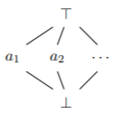
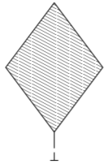
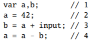
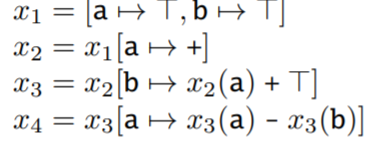
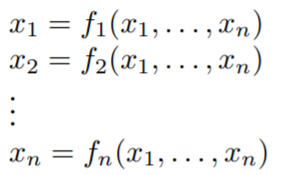
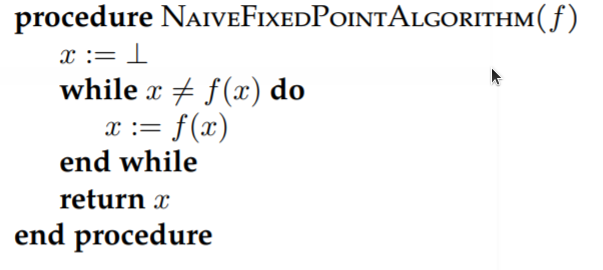
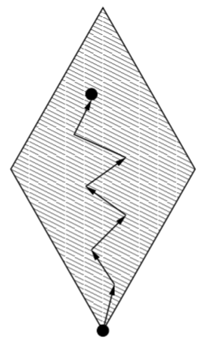

# Lattice Theory

[toc]

This note summarizes the content of chapter 4 of [Static Program Analysis](https://cs.au.dk/~amoeller/spa/spa.pdf) (by Anders Møller and Michael I. Schwartzbach).

## Lattices

### Partial Order

A partial order is a set $S$ equipped with a binary relation $\sqsubseteq$ where the following conditions are satisfied:

* Reflexivity: $\forall x \in S: x \sqsubseteq x$
* Transitivity: $\forall x,y,z \in S, x \sqsubseteq y \ \land y \sqsubseteq z \ \Rightarrow x\sqsubseteq z$

* Anti-symmetry: $\forall x,y \in S, x \sqsubseteq y \ \land y \sqsubseteq x \Rightarrow x = y$

### Bound

Let $X \subseteq S$ and $y \in S$.

$y$ is an upper bound for $X$(written as $X \sqsubseteq y$) **iff**  $\forall x \in X, x \sqsubseteq y$.

$y$ is an lower bound for $X$(written as $y \sqsubseteq X$) **iff**  $\forall x \in X, y \sqsubseteq x$.

$\sqcup X$ is a least upper bound for $X$, **iff**  $(X \sqsubseteq \sqcup X )$ and $(\forall y \in S, X \sqsubseteq y \Rightarrow \sqcup X \sqsubseteq y)$ 

$\sqcap X$ is a greatest lower bound for $X$, **iff**  $(\sqcap X \sqsubseteq X )$ and $(\forall y \in S, y \sqsubseteq X \Rightarrow y \sqsubseteq \sqcap X)$ 

For simplicity, for element $x$ and $y$, we use $x \sqcup y$ instead of $\sqcup \{ x,y\}$ and $x \sqcap y$ instead of $\sqcap \{ x,y\}$.

### Lattice

A lattice is a partial order $(S,\sqsubseteq)$ in which $x \sqcup y$ and $x \sqcap y$ exist for all $x,y \in S$.

A complete lattice is a partial order $(S,\sqsubseteq)$ in which $\sqcup X$ and $\sqcap X$ exist for all $X \subseteq S$.

Every lattice has a unique largest element denoted $\top$ and a unique smallest element denoted $\bot$.

The height of a lattice is defined to be the length of the longest path from $\top$ to $\bot$.

If $A = \{ a_1, a_2,... \}$ is a set, then $flat(A)$ is illustrated by

### Features

#### Product

If $L_1,L_2,...,L_n$ are complete lattices, then so is the product:
$$
L_1 \times L_2 \times ... \times L_n = \{ (x_1,x_2,...,x_n) \mid x_i \in L_i \}
$$
where the new order $\sqsubseteq$ is defined as
$$
(x_1,x_2,...,x_n) \sqsubseteq (x_1',x_2',...,x_n') \Leftrightarrow \forall i = 1,2,..,n: x_i \sqsubseteq x_i'
$$

Here, if we set element $x = (x_1,x_2,...,x_n)$ and $y = (y_1,y_2,...,y_n)$,

then we have $x \sqcup y = (z_1,z_2,...,z_n)$ where $\forall i = 1,2,...,n: z_i = x_i \sqcup y_i$,

and $x \sqcap y = (z_1,z_2,...,z_n)$ where $\forall i = 1,2,...,n: z_i = x_i \sqcap y_i$.

Also, $height(L_1 \times L_2 \times ... \times L_n) = height(L_1) + height(L_2) + ... + height(L_n)$

#### Map

If $A$ is a set and $L$ is a complete lattice, then a map lattice is
$$
A \rightarrow L = \{ [a_1 \rightarrow x_1, a_2 \rightarrow x_2,...] \mid A = \{ a_1,a_2,... \} \land x_1,x_2,... \in L  \}
$$
and the new order is
$$
f \sqsubseteq g \Leftrightarrow \forall a_i \in A: f(a_i) \sqsubset g(a_i) \ where \ f,g \in A \rightarrow L 
$$

#### Homomorphism

If $L_1$ and $L_2$ are lattices, then a function $f : L_1 \rightarrow L_2$ is a homomorphism **iff** 
$$
\forall x, y \in L_1 : f(x \sqcup y) = f(x) \sqcup f(y) \land f(x \sqcap y) = f(x) \sqcap f(y)
$$
If there exists function $f: L_1 \rightarrow L_2$ and $g: L_2 \rightarrow L_1$ and they both satisfies homomorphism, then we say $L_1$ and $L_2$ are isomorphism.

#### Lift

If $L$ is a complete lattice, then so is $lift(L)$, which is a copy of $L$ but with a new bottom element:

## Equations

### Example

For Sign analysis, here is a snippet of simple code as an example:

We can use constraint variables $x_i$ whose value is from lattice $StateSigns = Vars \rightarrow Sign$.

### Monotone

Given a function $f : L_1 \rightarrow L_2$ where $L_1$ and $L_2$ are lattices, we say $f$ is monotone **iff**  $ \forall x,y \in L_1 : x \sqsubseteq y \Rightarrow f(x) \sqsubseteq f(y)$.

More generally, Given a function $f : L_1 \times L_2 \rightarrow L_3$ where $L_1,L_2$ and $L_3$ are lattices, we say $f$ is monotone **iff**  $ \forall x_1,y_1 \in L_1, x_2 \in L_2 : x_1 \sqsubseteq y_1 \Rightarrow f(x_1,x_2) \sqsubseteq f(y_1,x_2)$ and $ \forall x_1 \in L_1, x_2,y_2 \in L_2 : x_2 \sqsubseteq y_2 \Rightarrow f(x_1,x_2) \sqsubseteq f(x_1,y_2)$

It means that "more precise input does not result in less precise output"

### Fixed point

we say that $x \in L$ is a fixed point for $f: L \rightarrow L$ **iff** $f(x) = x$.

A least fixed point $x$ for $f$  **iff** $x$ is a fixed point for $f$ and $\forall y$ s.t. $y$ is fixed point for $f$, $x \sqsubseteq y$.

### Equation

For a complete lattice $L$, we set variables $x_1,x_2,...,x_n \in L$ and constraint functions $f_1,...,f_n: L^n \rightarrow L$.

So we have an equation system:

If we combine those $n$ functions into one: $f: L^n \rightarrow L^n$ s.t.
$$
f(x_1,x_2,...,x_n) = (f_1(x_1,x_2,...,x_n),f_2(x_1,x_2,...,x_n),...,f_n(x_1,x_2,...,x_n))
$$
 then we have the equation system:
$$
x = f(x)
$$
where $x \in L^n$.

### Fixed-point theorem

In a complete lattice $L$ with finite height, every monotone function $f : L \rightarrow L$ has a unique least fixed point denoted $lfp(f)$ defined as
$$
lfp(f) = \cup_{i \geq 0} f^i(\bot) 
$$
**proof:**

Since $\bot$ is the least element, $\bot \sqsubseteq f(\bot)$.

Since $f$ is monotone, $f(\bot) \sqsubseteq f(f(\bot)) = f^2(\bot)$, and by induction we have $f^{i}(\bot) \sqsubseteq f(f^{i}(\bot)) = f^{i+1}(\bot)$.

Therefore, we have an increasing chain:
$$
\bot \sqsubseteq f(\bot) \sqsubseteq f^2(\bot) \sqsubseteq...
$$
Since $L$ has a finite height, there must exist $k$ such that $f^k(\bot) = f^{k+1}(\bot)$. It is obvious that $f^k(\bot)$ is a fixed point for $f$ and $f^k(\bot)$ is the least upper bound for all the elements in the chain, so we first guess that $lfp(f) = f^k(\bot)$.

Assume that $x$ is another fixed point.

Since $\bot \sqsubseteq x$ and $f$ is monotone, we have $f(\bot) \sqsubseteq f(x) = x$. So we also have $f^2(\bot) =  f(f(\bot)) \sqsubseteq f(f(x)) = f(x) = x$. 

By induction, we have $f^k(\bot) \sqsubseteq x$. Therefore,  $f^k(\bot)$ is a least fixed point and the guess of $lfp(f) = f^k(\bot)$ is correct.

If there are two least fixed point $x_1$ and $x_2$, then based on the result above, we have $x_1 \sqsubseteq x_2$ and $x_2 \sqsubseteq x_1$. By anti-symmetry, we can know that the least fixed point is unique.

#

This theorem tells us not only that equation systems over complete lattices always have solutions, provided that the lattices have finite height and the constraint functions are monotone, but also that uniquely most precise solutions always exist.

Also, we can have a naive fixed point algorithm based on the chain method:

The exploration in a lattice is just like this:

