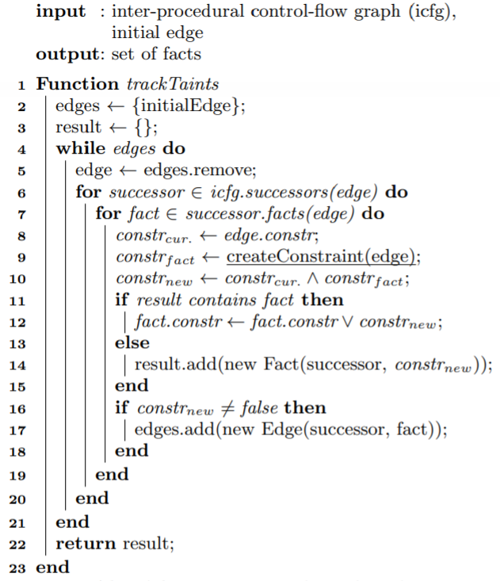

# Tracking Load-time Configuration Options

[toc]

This is the note of paper [Tracking Load-time Configuration Options](https://www.bodden.de/pubs/lkb14tracking.pdf).

## Introduction

For load-time parameters, identifying the code fragments that implement an option manually requires tedious effort.

`Lotrack` aims at identifying all code that is included if and only if a specific configuration option or combination of configuration options is selected.

To increase precision, we exploit the insight that configuration options are typically used differently from other values in the code: **Values for configuration options are often passed along unmodified and are used in simple conditions, making their tracking comparatively easy and precise.**

Technically, `Lotrack` extends a **context, flow, object and field-sensitive taint analysis** to build a configuration map describing how code fragments depend on configuration options.

## Problem

Our goal is to trace configuration options to the code fragments implementing them.

Technically, we seek to establish a configuration map which maps every code fragment to a configuration constraint describing in which configurations the code fragment may be executed in the program, that is, which configuration options or combinations of options need to be selected or deselected.

Here are the assumptions:

1. Configuration options are set at program load time and do not change during the execution of the program.
2. The API calls to load configuration values are known and can be identified syntactically; the possible values of configuration options are finite and known.

## Approach

Static taint analysis

About how to handle native functions and environment interactions, we allow false negatives and only create taints for results of native-method calls or environment interactions if they have been parameterized with a tainted value.

To track configuration values, `Lotrack` implements several extensions to the taint analysis. In particular, `Lotrack` tracks a taint for each possible value of a variable and tracks a **constraint** under which configuration this variable has this value. Second, `Lotrack` does not propagate all taints directly, but analyzes, restricts, and merges constraints at control-flow decisions.

The analysis creates a taint for every possible value because options usually have small finite domains.

The taint information denoted by the variable and the tracked value together with the constraint constitute a **fact**. A fact is no longer propagated, however, if the corresponding constraint is unsatisfiable.

If a control-flow decision depends on a tainted value, we derive constraints for the control-flow branches by evaluating the branching condition.

## Algorithm

`Lotrack` works on top of a taint analysis which provides the functionality of taint creation and propagation as well as common features of static program analysis like call-graph creation and alias analysis.

The analysis works on the level of summary edges. An edge consists of 

* a source fact,
* a target fact, 
* the source statement
* the target statement
* a constraint.

The taint-tracking algorithm is shown below:

It is a worklist algorithm. Its initial edge has a constraint of `true`.

Using a normal taint analysis, the possible taints at the successor are determined based on the current edge(line 7).

Line 10 in Algorithm 1 combines the resulting constraint for the edge from Algorithm 2 by conjoining it with the constraint propagated to this edge so far (Line 8).

Facts are not propagated further if the resulting constraint is unsatisfiable.

The algorithm of `createConstraint` is shown below:

This algorithm computes the constraint for the propagation of a fact along a control-flow edge using the information in the **edge** as well as **other facts for the same statement**.

An API access or an if statement can lead to the creation of new constraints.

For line 25 to line 31, the algorithm creates an initial edge pointing to the fact representing the accessed option. If the value can not be tracked we can return a `?`.

For line 32 to line 48, a new constraint is created if the condition of the if statement is dependent on a tainted value.

* Line 24 to line 41 tells us that the constraints of all matching facts are combined as a disjunction to create the most general constraint for this branching statement. 
* Line 43 shows that the resulting constraint is used for the branch edge and its negation for the fall-through edge. 

* Line 46 tells us that if no fact matched the condition, the algorithm returns true, which indicates that the condition is not dependent on any configuration option and therefore should not change the constraint of any facts.