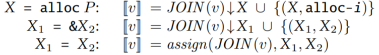
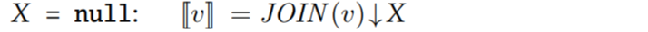

# Flow-Sensitive Points-to Analysis

[toc]

This note summarizes the content of chapter 10.6 of [Static Pointer Analysis](https://cs.au.dk/~amoeller/spa/spa.pdf).

## Modeling

### Lattice

We use a lattice of points-to graphs, which are directed graphs in which the nodes are the abstract cells for the given program and the edges correspond to possible pointers.

Points-to graphs are ordered by inclusion of their sets of edges. Thus, $\bot$ is the graph without edges and $\top$ is the completely connected graph.

We use $Cells$ to denote the set of abstract cells for the given program.

The abstract state is
$$
States = P(Cells \times Cells)
$$
So for each state $s \in States$, $s$ represents the nodes and edges in a points-to graph.

For example, $Cells = \{ a,b,c,m1,m2,m3 \}$. So state $s = \{ (a,m1),(b,m2),(c,m3) \}$ corresponds to

```
a ->  m1
b ->  m2
c ->  m3
```

### Constraint

For every CFG node $v$, we introduce a constraint variable $[v]$ denoting a points-to graph that describes all possible stores at that program point.

So based on the requirement of points-to analysis, we have these constraints for some special nodes:





And for all other nodes, we have
$$
[v] = JOIN(v)
$$
where $JOIN(v)$ unions the point-to locations of $v$'s precedent nodes:
$$
JOIN(v) = \cup_{w \in pred(v)} [w]
$$
$ \sigma \downarrow x$ means killing the original points-to set of $x$:
$$
\sigma \downarrow x = \{ (s,t) \in \sigma \mid s \neq x \}
$$
$assign(\sigma,x,y)$ means replacing the points-to set of $x$ with the points-to set of $y$.
$$
assign(\sigma,x,y) = \sigma \downarrow x \ \cup \{ (x,t) \mid (y,t) \in \sigma \}
$$


As you can see, this analysis is flow sensitive and the update is strong update!!!

Therefore, we can have function $pts$ to calculate the points-to set of cell $p$ at node $v$. 
$$
pts(p) = \{ t \mid (p,t) \in [v] \}
$$
