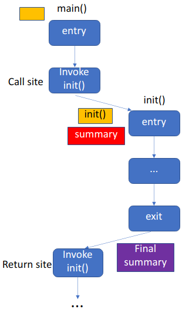
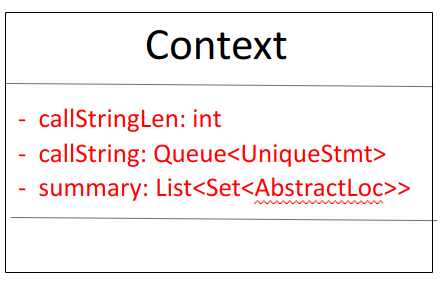
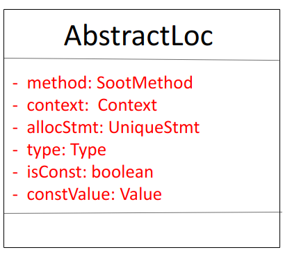

# My Points-to Analysis

[toc]

## Introduction

Here, this is my algorithm of a inter-procedural context-, flow-, field-sensitive points-to analysis for Java.

I will leverage `Soot` and implement this algorithm in `cflow` to make its taint analysis more precise.


For more information about `cflow`, please see [source](https://github.com/xlab-uiuc/cflow) and [my notes](https://github.com/fanweneddie/cflow/tree/dev/doc/notes/papers/cflow).

For more information about static program analysis, please see my notes below:

* [Lattice theory](https://github.com/fanweneddie/cflow/tree/dev/doc/notes/papers/Lattice)

* [Interprocedural analysis](https://github.com/fanweneddie/cflow/tree/dev/doc/notes/papers/Interprocedural_analysis)
* [IFDS](https://github.com/fanweneddie/cflow/tree/dev/doc/notes/papers/IFDS)

* [Pointer analysis](https://github.com/fanweneddie/cflow/tree/dev/doc/notes/papers/Pointer_Analysis)

## Modeling

In `Soot`, we call intra-procedural analysis multiple times to simulate an inter-procedural analysis.

For each procedure, we have the lattice $L = States^{n}$, where $States = Vars \rightarrow location \ set$ and $n$ is the number of nodes in CFG. The detailed info of $L$ is shown as follows:

* **Element**:  `Map<variable, set<abstract location>>` at each node in CFG

* **Order**:  element $s_1 \sqsubseteq s_2$ **iff**  $\forall$ variable $v, s_1(v) \subseteq s_2(v)$  

* **Direction**: forward

* **Meet operator**:  For current node $n$, we denote $JOIN(n)$ to union the points-to set of each variables among each predecessor node $m$
  $$
  JOIN(n) = \cup_{m \in pred(n)} [\![ m]\!]
  $$
  where $[\![ m]\!]$ is the map at node $m$.  

* **Transfer function**: 

  * For allocation statement `i : a = new T` at node $n$:
    $$
    [\![n]\!] = JOIN(n) \downarrow a \ \cup \{ (a,alloc\_i) \}
    $$
    where $ \sigma \downarrow x$ means killing the original points-to set of $x$:
    $$
    \sigma \downarrow x = \{ (s,t) \in \sigma \mid s \neq x \}
    $$

  * For assignment statement `a = b` at node $n$:
    $$
    [\![n]\!] = assign(JOIN(n),a,b)
    $$
    where $assign(\sigma,x,y)$ means replacing the points-to set of $x$ with the points-to set of $y$.
    $$
    assign(\sigma,x,y) = \sigma \downarrow x \ \cup \{ (x,t) \mid (y,t) \in \sigma \}
    $$

* **Initial state**: If there is context, add the point-to set of `this object` and arguments for initialization.

Note that lattice $L$ is not a map lattice(Although its elements are map), but it is a product lattice of each node in CFG.

## Inter-procedural Analysis

### Top-down Method

For inter-procedural analysis, I currently use a **top-down** method: That is, I start at entry main method of a program and when I encounter an invoke call, I build a new context and start to analyze the callee. 

For example, Figure 1 shows a simple example. In this figure, blue blocks represent nodes in control flow graph. Arrows represent flows in control flow graph. Yellow blocks represent call strings in the context. The red block represents the initial summary of the context and the purple block represents the final summary of the callee method. 

As is shown below, 

* we first analyze method `main()`, where we encounter the invoke to `init()` . 
* Later, we initialize the summary and build the context to analyze method `init()`.
* Finally, we analyze method `main` after the exit of callee method `init()`. 



<div align = "center">Figure 1: Example of inter-procedural analysis</div> 

As for the same example, The original method in `cflow` does these steps:

* In iteration 1, `cflow` first analyzes method `main()` and constructs the summary(e.g. `entryTaint`) for `init()` when visiting the call site of invoke node. `cflow` will also try to get summary from callee method `init()` in at the return site of invoke node, though it will get nothing(because `cflow` has not analyzed method `init()`)
* In iteration 1, `cflow` later analyzes callee method `init()` and finishes its summary when visiting return node.
* In iteration 2, `cflow` first analyzes method `main()` again and get the summary from method `init()` at the return site of invoke node.
* In iteration 2, `cflow` later analyzes callee method `init()` and finds that nothing changes.
* In iteration 3, `cflow` analyzes `main()` and `init()` , only to find that nothing changes. Therefore the iteration is over.

### Feature

The method used in `cflow` 

* saves heap memory. At one time, there is at most one Soot Analysis object doing analysis. When an Analysis object has done its job, its corresponding space will be freed by garbage collection. 
* wastes time, since it has to do some redundant analysis.

The top-down method

* saves time, because it just simulates the real process of method call/return and only analyzes the methods that need to be analyzed.
* wastes heap memory, because many Soot Analysis objects may exist at the same time(For example, when analyzing method `init()`, the Analysis object that analyzes `main()` still exists). So a lot of heap space may not be freed and recycled in the process.

## Classes

I have designed some classes to build the points-to analysis.

### Context

I use `Context` to represent the context of a method. Here I use call string with a `k-limiting` approximation to simulate the context. `Context` has fields of:

* `callStringLen`: The maximum length of call string
* `callString`: A list of k-nearest call statements in stack, which simulates the context
*  `summary`: A list showing the points-to set of base object, return value and arguments.

The fields of class `Context` is shown in Figure 2.



<div align = "center">Figure 2: Class of Context</div> 

### AbstractLoc

I set class `AbstractLoc` to describe the abstract location of an object in heap. `AbstractLoc` has fields of:

* `method`: The method that the allocation site is in
* `context`: The calling context of that method
* `allocStmt`: The allocation statement
* `type`: The type of the object
* `isConst`: The flag showing whether the object is a constant in constant pool
*  `constValue`: The constant value of this object(if it is a constant)

The fields of class `AbstractLoc` is shown in Figure 3.



<div align = "center">Figure 3: Class of AbstractLoc</div> 

### PointsToAnalysis

I set class `PointsToAnalysis` to implement the points-to analysis. It extends Soot class `ForwardFlowAnalysis`. At each node, the element is `Map<Value, Set<AbstractLoc>>`, which guarantees that the analysis is flow-sensitive.

```java
public class PointsToAnalysis extends ForwardFlowAnalysis<Unit, Map<Value, Set<AbstractLoc>>> {
```

#### Fields

In `PointsToAnalysis`, I define some fields:

* `method` of class `SootMethod`, which denotes the current method
* `context` of class `Context`, which denotes the current context

* A global points-to map `methodSummary` of type `Map<SootMethod, Map<Context, Map<UniqueStmt, Map<Value,Set<AbstractLoc>>>>>` , which maps the variables $v$ at each statement $s$ in method $m$ with context $c$ to its possible points-to set of abstract locations. 

  ```
  method, context, statement, variable -> set of abstractLoc 
  ```

* `specialVarList` of type `List<Value>`, which denotes the special variables(base object, return value and arguments) in this method.

* `finalMethodSummary` of type `Map<SootMethod, Map<Context, List<Set<AbstractLoc>>>> `, which maps the special variables $v$ in method $m$ with context $c$ to its possible points-to set of abstract locations. 

  ```
  method, context, special variable -> set of abstractLoc 
  ```

#### Methods

In `PointsToAnalysis`, I simulate `TaintFlowAnalysis` and define some methods. They are briefly introduced as follows:

##### flowThrough

Method `flowThrough()` overrides the method in the super class and defines how to visit a node in control flow graph. 

Firstly, it will initialize the node element by in-set.(Note that the type of node element is `Map<Value, Set<AbstractLoc>>>`, we call this update as **strong update**)

Secondly, according to the type of current statement, we do different operations

* If the statement is an `identity` statement such as `r0 := @this: Dog`, it will call `visitIdentity()`.

* If the statement is a `new` statement such as `r1 = new Dog`, it will call `visitNew()`.
* If the statement is a `normal assignment` statement such as `r1 = r2`, it will call `visitNormalAssign()`.
* If the statement is an `init invoke` statement of  class `Object` such as `specialInvoke r0.<java.lang.Object: void <init>()>()`, it will call `visitAlloc()`.
* If the statement is the other `invoke` statement such as `specialInvoke $r0.<Dog: void <eat>()>()`, it will call `visitInvoke()`.
* If the statement is `return` statement such as `return r1`, it will call `visitReturn()`.

Thirdly, we generate the out-set according to the revised element in this node.

##### visitIdentity

This method deals with the `identity` statement such as `r0 := @this: Dog` and `r2 := @parameter0:java.lang.String[]`. 

Since `identity` statement can tell us which variable refers to base object or argument, I record this info into `methodSummary` and `specialVarList`  in method `visitIdentity()`.

##### visitNew

This method deals with `new` statement such as `r1 = new Dog`. 

Usually, an invoke of `init` statement is placed after the `new` statement. Here, `new` statement plays a role of declaring a new variable and method `init()` allocates the memory for that variable. Therefore, `visitNew()` just sets the points-to set of that variable as empty.

 ##### visitNormalAssign

This method deals with `assign` statement such as `r1 = r2` or `r1 = "helloworld"`.

For the former one, I replace the points-to set of `r1` by the points-to set of `r2`.

For the latter one, I create a new `AbstractLoc` for constant and put it into the points-to set of `r1`.

##### visitAlloc

This method deals with `init invoke` statement of  class `Object`, which allocates memory space for an object.

Here, I construct a new `AbstractLoc` and use it to strong-update the points-to set of the object.

##### visitInvoke

This method deals with the other `invoke` statement such as `specialInvoke $r0.<Dog: void <eat>()>()`. 

It will firstly create a new context for the callee method, then analyze the callee method, and finally update the points-to set at return site by the `finalMethodSummary` of the callee method.

When creating a new context, it will add the current invoke statement into `callString` and use a `k-limiting` approximation. It also copies the points-to set of base object and arguments into the `summary` of new context.

When analyzing the callee method, it will check whether callee method is a Java library method. If so, we will skip it for a better performance(just like `taintWrapper`).  Otherwise, it will create a new object of `PointstoAnalysis` and analyze the callee method.

When updating the points-to set at return site, it leverages the info in `finalMethodSummary` of callee method. Note that `finalMethodSummary` collects the points-to set of base object, return value and arguments at the end of one method. So this step propagates the info from callee back to the caller.

##### visit Return

This method deals with `return` statement such as `return r1`, it will call `visitReturn()`.

According to `specialVarList`, it knows which object is base object or return value or argument. Therefore, it can copy their points-to set into `finalMethodSummary` as a final summary.

## Tests

My environment is 

* CPU: 8 * Intel(R) Core(TM) i5-8250U CPU @ 1.60GHz 
* CPU cache: 6144 KB
* Memory: 7845 MB
* Swap area: 975 MB
* hard disk: SAMSUNG MZVLW256HEHP-00000 SSD  236.26 GiB
* OS: ubuntu 20.04
* kernel: 5.4.0-84-generic
* java: 1.8.0_291
* maven: maven-3.6.3

I run

```
./run.sh -a hadoop_common
```

However, it runs for 13 min and finally reports a bug of 

```
org.apache.maven.lifecycle.LifecycleExecutionException: Failed to execute goal org.codehaus.mojo:exec-maven-plugin:3.0.0:java (default-cli) on project ccc: An exception occured while executing the Java class. Java heap space
```

which shows that there is no enough heap space.


It seems that my original version of points-to analysis is both time- and space-consuming and cannot scale to large applications such as `hadoop`.
