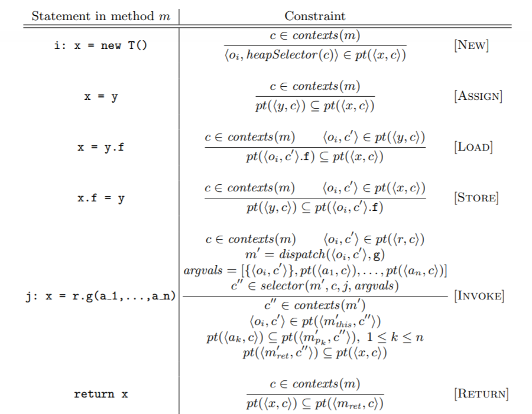
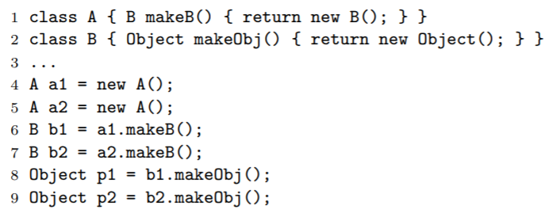
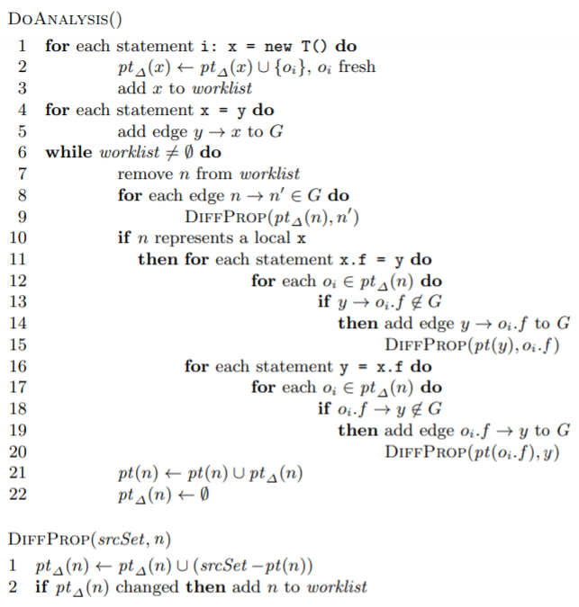

# Alias analysis for OOP

[toc]

## Overview

source: [Alias Analysis for Object-Oriented Programs](https://manu.sridharan.net/files/aliasAnalysisChapter.pdf)

Pointer Analysis is also called Alias Analysis.

We need to check whether two variable expressions point to/reference the same memory location.

A points-to analysis computes an over-approximation of the heap locations that each program pointer may point to.

We have the version of [context-insensitive](#context-insensitive) and [context-sensitive](#context-insensitive).

## Context-insensitive

We have two flow-insensitive and context-insensitive algorithms: `Andersen` and `Steensgaard`.

Since they are `flow-insensitive`, we can execute those algorithms on `AST`.

### Andersen

Source: [Pointer Analysis in cs252 in Havard](http://web-static-aws.seas.harvard.edu/courses/cs252/2011sp/slides/Lec06-PointerAnalysis.pdf)

#### Introduction

`Andersen` algorithm is a flow-insensitive and context-insensitive algorithm. It is a constraint-based algorithm and focuses on **subset constraints** of assignment:

* `a = &b`:          $loc(b) \in pts(a)$
* `a = b`:            $pts(b) \subseteq pts(a) $
* `a = *b`:          $\forall v \in pts(b), pts(v) \subseteq pts(a)$
* `*a = b`:          $\forall v \in pts(a), pts(b) \subseteq pts(v)$

Or for some `oop` languages such as `Java`, we can have constraint rules: 


#### Example

For example,  for statements in `C`:

```c
p = &a		// 1
q = &b		// 2
*p = q;		// 3
r = &c;		// 4
s = p;		// 5
t = *p;		// 6
*s = r;		// 7
```

By `Andersen`, we have

1. $\{a\} \subseteq p$
2. $\{b\} \subseteq q$
3. $\forall v \in p, q \subseteq v$
4. $\{c\} \subseteq r$
5. $p \subseteq s$
6. $\forall v \in p, v \subseteq t$
7. $\forall v \in s, r \subseteq v$

At first round, it is

$pts(p) = \{a\}$

$pts(q) = \{b\}$

$pts(a) = \{b,c\}$

$pts(r) = \{c\}$

$pts(s) = \{a\}$

$pts(t) = \{b\}$

$pts(b) = \empty$

$pts(c) = \empty$

At second round, it is

$pts(p) = \{a\}$

$pts(q) = \{b\}$

$pts(a) = \{b,c\}$

$pts(r) = \{c\}$

$pts(s) = \{a\}$

$pts(t) = \{b,c\}$

And that's the final result. 

It is **more precise** but **less scalable**.

#### Implementation

We can also use a workList graph algorithm to solve this problem.

The initialization of graph(based on assignment) is like this:

* `a = &b`,  we have $\{b\} \subseteq a$.
* `a = b`, we have $b \subseteq a$ and we build an edge $b \rightarrow a$.
* `a = *b`, we have $^*b \subseteq a$.
* `*a = b`, we have $b \subseteq \ ^*a$.

```pseudocode
Initialize graph and points to sets using base and simple constraints
Let W = { v | pts(v) ≠ ∅ } (all nodes with non-empty points to sets)

While W not empty
	v ← select from W
	for each a ∈ pts(v) do
		for each constraint p ⊇*v
			add edge a -> p, and add a to W if edge is new
		for each constraint *v ⊇ q
			add edge q -> a, and add q to W if edge is new
	for each edge v -> q do
		pts(q) = pts(q) ∪ pts(v), and add q to W if pts(q) changed
```

It is flow-insensitive because it is an **iteration** algorithm and does not care about the sequence of flow.

The complexity of `Andersen` algorithm is $O(n^3)$, where $n$ is the number of nodes in graph.

We can reduce $n$ by collapsing `SCC` to single node in point-to graph.

### Steensgaard

#### Introduction

`Steensgaard` algorithm focuses on **equality constraints**, which means that it view assignments as being **bidirectional**.

* `a = alloc-i`	 $\{alloc-i\} \in pts(a)$	                        set $a = \uparrow [alloc-i]$

* `a = &b`:               $loc(b) \in pts(a)$                                     set $[a] = \uparrow [b]$
* `a = b`:                 $pts(a) = pts(b) $                                    set $[a] = [b]$

* `a = *b`:               $\forall v \in pts(b), pts(a) = pts(v)$             if we can set $[b] = \uparrow \alpha$, then $a = \alpha$
* `*a = b`:               $\forall v \in pts(a), pts(b) = pts(v)$             if we can set $[b] = \alpha$, the $[a] = \uparrow \alpha$

It is **less precise** but **more scalable**.


## Context-sensitive

Context-sensitive points-to analysis analyzes a method $m$ for each calling context that arises at call sites of $m$.

A `calling context` is some abstraction of the program states at may arise at a call site.

We assume that a method $m$ has formal parameters $m_{this}$ for the receiver and $m_{p_1},...,m_{p_n}$ for the parameters, and a variable $m_{ret}$ to hold the return value.

Here we have some data structures:

* a set $contexts(m)$: the contexts that have risen at call sites of each method $m$.
* an abstract pointer $<x,c>$ represents $x$'s possible values when its enclosing method is invoked in context $c$.
* an abstract location $<o_i,c>$ represents the value of object at allocation site $i$ when its enclosing method is invoked in context $c$.
* `selector function`: it determines what context to use for a callee at some call site.
* `heapSelector function`: it determines what context $c$ to use in an abstract location $<o_i,c>$ at allocation site $i$.

Here we have constraints for different types of statements:

* **New** constraint for statement `i: x = new T()`:

  for $c \in contexts(m)$, we have $<o_i, heapSelector(c)> \in pt(<x,c>)$.

  Can't we just use $c$ instead of $heapSelector(c)$?

* **Assign** constraint for statement `x = y`

  for $c \in contexts(m)$, we have $pt(<y,c>) \subseteq pt(<x,c>)$.

* **Load** constraint for statement `x = y.f`

  for $c \in contexts(m)$ and $<o_i,c'> \in pt(<y,c>)$, we have $pt(<o_i,c'.f>) \subseteq pt(<x,c>)$.

* **Store** constraint for statement `x.f = y`

  for $c \in contexts(m)$ and $<o_i,c'> \in pt(<x,c>)$, we have $pt(<y,c>) \subseteq pt(<o_i,c'>.f)$.

  As we can see in **Load** and **Store**, it uses a `field-sensitive` method. Also note that more complex field assignment can be simplified by temporary variables.

* **Invoke** constraint for statement `j: x = r.g(a_1,...,a_n)`

  for $c \in contexts(m)$ and $<o_i,c> \in pt(<r,c>)$,  we get target method $m' = dispatch(<o_i,c'>,g)$ through a virtual dispatch.

  Also, we have $argvals = [\{ <o_i,c'> \}, pt(<a_1,c), pt(<a_n,c>)]$, and we get the context $c'' \in selector(m', c, j, argvals)$ of the invoked method $m'$.

  The conclusion is that

  * $c'' \in contexts(m')$
  * $<o_i,c'> \in pt(<m'_{this},c''>)$
  * $pt(<a_k,c>) \subseteq pt(<m'_{p_k},c''>)$
  * $pt(<m'_{ret},c''>) \subseteq pt(<x,c>)$ **??? why do we need to pass return value in invoke statement?**

* **Return** constraint for statement `return x`

  for $c \in contexts(m)$, $pt(<x,c>) \subseteq pt(<m_{ret},c>)$.

That is



### Call Strings

A standard technique to distinguish contexts is via call strings.

Call strings are typically represented as a sequence of call site identifiers, corresponding to a (partial) call stack.

In this way, we can set function $selector(m',c,j,argvals)$ as
$$
selector(\_,[j_0,j_1,...,j_n],j,\_) = \{ [j,j_0,j_1,...,j_n] \}
$$
where caller context $c = [j_0,j_1,...,j_n]$

Also, it is obvious to see that 
$$
heapSelector(c) = c
$$
For example, given the program

```java
Object f1(T x) { return x.f; }          // 1
Object f2(T x) { return f1(x); }        // 2
...                                     // 3
p = f2(q);                              // 4
r = f2(s);                              // 5
```

Method `f2()` is analyzed in contexts `[cs4]` and  `[cs5]`.

Method `f1()` is analyzed in contexts `[cs2, cs4]` and `[cs2, cs5]`. 

Unfortunately, recording all call strings is not scalable, so we have a `k-limiting` method to bound the maximum call-string length as a constant $k$.

### Object Sensitivity

It uses the (abstract) objects passed as the receiver argument to the method.

By using receiver objects to distinguish contexts, an object-sensitive analysis can avoid conflation of operations performed on distinct objects.

Therefore, context is a list of allocation sites of receiver objects.

Now, we can define $selector$ function as
$$
selector(\_,\_,\_,argvals) = \cup_{<o,c> \in argvals[0]} locToContext(<o,c>)
$$
where
$$
locToContext(<o_i,[o_1,o_2,...]>) = [o_i,o_1,o_2,...]
$$
For example, for the following program:



Method `makeB()` will be analyzed in contexts `[o4]` and `[o5]`, so we have $pt(b1) = \{ <o1,[o4]> \}$ and $pt(b2) = \{ <o1,[o5]> \}$.

Method `makeObj()` will be analyzed in context `[o1,o4]` and `[o1,o5]`, so we have $pt(p1) = \{ <o2,[o1,o4]> \}$ and $pt(p2) = \{ <o2,[o1,o5]> \}$.

### Pros and Cons

For different call sites that pass the same receiver object, `Object sensitivity` may lose precision. For example:

```java
class A {B makeB() { return new B();} }					// 1
class B { }												// 2
...														// 3		
A a = new A();											// 4
B b1 = a.makeB();										// 5		
B b2 = a.makeB();										// 6
```

Here we have $pt(b1) = \{ <o1,[o4]> \} = pt(b2) = \{ <o1,[o4]> \}$, which is imprecise.

However, for a single call site with possibly multiple receiver objects, `Object sensitivity`  can gain precision by using multiple contexts. For example ???

```java
class A { C makeC() {return new C();} }					// 1
class B extends A { C makeC() {return new C();} }		// 2
class C {}												// 3
... 													// 4	
A a = new B();											// 5
C c = a.do();											// 6
```


In practice, a mix of object- and call-string sensitivity is often used, e.g., with `call string` sensitivity being employed only for static methods (which have no receiver argument).

## Implementation

We can use an iteration implementation and reduce the problem to a graph reachability problem.

I haven't fully understood this implementation.



