# Bottom-up Context-Sensitive Pointer Analysis for Java

[toc]

This note is the summary of the paper: [Bottom-up Context-Sensitive Pointer Analysis for Java](https://web.eecs.umich.edu/~xwangsd/pubs/aplas15.pdf).

## Introduction

We can use `top-down` or `bottom-up` method for context-sensitivity.

A `top-down` method starts at entry methods of a program and analyzes callers before callees. It knows the context when analyzing each method, but it needs to re-analyze the same method multiple times under different contexts.

A `bottom-up` method starts at leaf methods of a program and analyzes callees before callers. It can generate a summary that can be used in any calling context to get context-sensitive results.

This paper presents a bottom-up context- and field-sensitive pointer analysis for Java. A key novel feature of our approach is the constraint-based treatment of virtual method calls. 

## Concepts

### Abstract heap

An abstract heap $H$ is a graph $(N,E)$ where $N$ is a set of nodes corresponding to `abstract memory locations` and $E$ is a set of directed edges between nodes, which is labeled with field names or $\epsilon$.

An edge $(o_1,o_2,f)$ indicates that the $f$ field of $o_1$ may point to $o_2$. An edge $(o_1,o_2,\epsilon)$ indicates that $o_1$(from stack) may point to $o_2$.

An `abstract memory location` represents either the stack location of a variable or a set of heap objects.

The root nodes of an abstract heap $H$(that is $root(H)$) denote locations of variables.

Given abstract heap $H_1$ and $H_2$, $H_1 \cup H_2$ represents the abstract heap containing nodes and edges from both $H_1$ and $H_2$.

### Normalization

Given an abstract heap $H$, we can define a normalization operation $N(H)$ to get a normalized heap $H^* = (N^*,E^*)$ and a map $\zeta: N \rightarrow N^*$ such that

* If $x \in root(H)$, then $x \in X^*$ and $\zeta(x) = \{ x \}$.

* If $(o,o',f) \in E$ and $o^* \in \zeta(o)$, then $o^*.f \in N^*$, $o^*.f \in \zeta(o')$ and $(o^*,o^*.f,f) \in E^*$.

  ```
   o     zeta   o*
   |            |
   | f   ===>   | f
   |            |
   o'    zeta   o*.f
  ```

$H^*$ corresponds to a generic heap representing the unknown points-to target of object $o$'s $f$ field as $o.f$.

For a method $m$, the normalization heap is the same regardless of different calling context.


Given a map $\zeta$, we can define $\zeta^{-1}$ such that $n \in \zeta^{-1}(n^*)$ iff $n^* \in \zeta(n)$.

$\zeta^{-1}$ can instantiate a method summary to a particular abstract heap at a call site.

### Default edge

An edge $(n,n',f)$ is a default edge of an abstract heap $H$ iff $n' = n.f$.

Given a heap $H$, we use $default(H)$ to represent the set of default edges in $H$.

## Summary-based Pointer Analysis

Given code snippet $S$, an abstract heap $H$ and pointer analysis $A$, we write $H' = Analyze(H,S,A)$ to show that: If statement $S$ is executed in an environment that satisfies abstract heap $H$, it will get a concrete heap $H'$ after using pointer analysis $A$ to analyze $S$.


## Formalization of Algorithm

### Grammar

The grammar of the oop language is shown as figure 1 

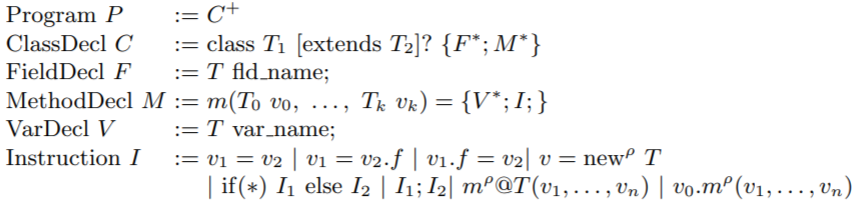

<div align = "center">Figure 1: Grammar of oop language</div> 

### Abstract Domains

Heap object $o$ has two kinds:

* $a_i.\eta$ represents unknown heap objects reachable through the $i$'th argument.
* $alloc(T)@\rho$ represents heap objects of type $T$ that are allocated either in the currently analyzed method or in a transitive callee.

Abstract memory location $\pi$ is either heap object $o$ or stack location($a_i$ denotes the stack location of the $i$'th argument and $v_i@\rho$ denotes the location of a local variable $v_i$ under context $\rho$).

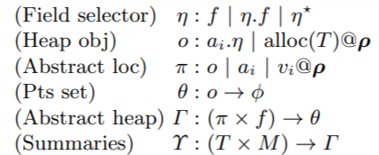

<div align = "center">Figure 2: Abstract domains</div> 

Here, the calling contexts is represented by a sequence of program points $\rho_1, \rho_2,...,\rho_n$, where $\rho_i$ corresponds to some call or allocation site.

An environment $ \Upsilon$ maps each method $M$ in class $T$ to its corresponding summary, which is a abstract heap $\Gamma$ that summarizes $M$'s side effects.

### Argument-derived location

A location $\pi$ is derived from an argument, written $arg(\pi)$, iff $\pi$ is

*  $a_i$ represents the location of the $i$'th argument or
* a heap object represented with an access path $a_i.\eta$

An abstract heap $\Gamma$ maps each field $f$ of location $\pi$ to a points-to set $\theta$. $\theta$ is a set of pairs $(o,\phi)$ where $o$ is a heap object and $\phi$ is a constraint.

Constraint $\phi$ is defined in Figure 3.

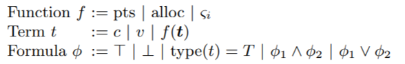

<div align = "center">Figure 3: Constraints</div> 

Here, terms include constant $c$, variables $v$ and function applications $f(t)$.

Function $f$ is point-to-set $pts$, or allocation $alloc$ or an n-ary function $\zeta_i$.

Formulas are composed of true, false, type checking and their conjunctions and disjunctions.

The alloc and type functions obey the additional axiom $\forall x, type(alloc(T,\rho)) = T$.

We also define an operation called $lift(\pi)$, abbreviated $\overline{\pi}$, as follows:

* $\overline{a_i} = a_i$

* $\overline{alloc(T)@\rho} = alloc(T,\rho)$
* $\overline{\pi.f} = pts(\overline{\pi},f)$
* $\overline{\pi.(f)^*} = \zeta_i(\overline{\pi},f)$

Given  a term $t$, $lift^{-1}(t)$ yields an abstract memory location representation of that term.

### has_type$(\theta,T)$

Given a points-to-set $\theta$, the function $has\_type(\theta,T)$ yields the following constraint:
$$
\cup_{(\pi_i,\phi_i) \in \theta}((type(\overline{\pi_{i}}) = T) \land \pi_{i})
$$

## Operations on Abstract Domains

### Default target

Given an argument-derived location $\pi$ and a field $f$, the default target of $\pi.f$, written $def(\pi,f)$ is given as follows:

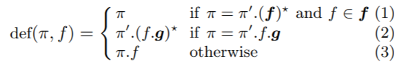

It distinguish the case of recursive data structures(1 and 2) and non-recursive data structures(3).

This is used to ensure termination of the fixed-point computation performed by our algorithm.

### Field look-up

Given heap $\Gamma$, field $f$, and location $\pi$, the field lookup operation $\Gamma[\pi,f]$ retrieves the points-to target for $\pi$'s field $f$:

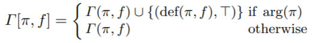

If $\pi$ is an argument derived location, we can add $def(\pi,f)$ as a default edge.

### Join

Since the analysis is a weak update, we should merge two points-to sets using the following join operator:

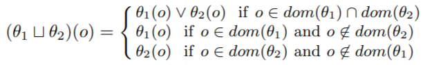

Note that $o \in dom(\theta_1)$ means that $o$ is in the domain of $\theta_1$.

### Projection

Given a points-to set $\theta$ and constraint $\phi$, we can conjoin $\phi$ with every constraint in $\theta$:
$$
\theta \downarrow \phi = \{ (\pi_i,\phi_i \land \phi) \mid (\pi_i,\phi_i) \in \theta \}
$$

 ### Field lookup

Here is the field lookup operation for a points-to set:
$$
\Gamma[\theta,f] = \cup_{(\pi_i,\phi_i) \in \theta} \Gamma[\pi_i,f] \downarrow \phi_i
$$
So $\Gamma[\theta,f]$ includes the points-to target of every element in $\theta$ under the appropriate constraints.

## Intraprocedural Analysis

The form $ \Upsilon,\Gamma \vdash I: \Gamma'$ indicates that if statement $I$ is executed in an environment that satisfies summary environment $\Upsilon$ and abstract heap $\Gamma$, then we can obtain a new heap $\Gamma'$.

Figure 4 shows the constraint rule of intraprocedural analysis:

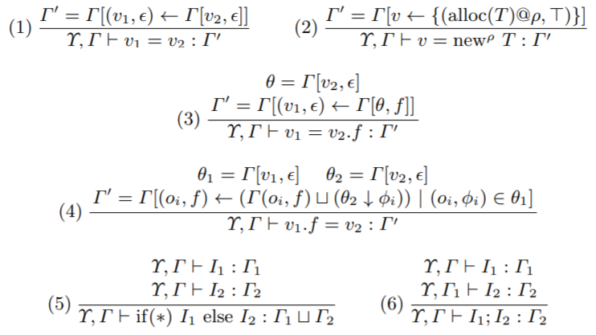

<div align = "center">Figure 4: Constraint rules for intraprocedural analysis</div> 

Rule (1) depicts **assignment** $v_1 = v_2$: It applies strong updates to variables and it updates the points-to set for $(v_1,\epsilon)$ to $\Gamma[v_2,\epsilon]$.

Rule (2) depicts **memory allocation** $v = new^{\rho} \ T$: It introduces a new abstract location named $alloc(T)@\rho$ and assigns $v$ with it.

Rule (3) depicts **load** $v_1 = v_2.f$: It first looks up the point-to set $\theta$ of $v_2$ and then uses $\Gamma[\theta,f]$ to retrieve the targets of memory locations in $\theta$. Finally, it override $v_1$'s existing targets and change its points-to set to $\Gamma[\theta,f]$.

Rule (4) depicts **store** $v_1.f = v_2$: We apply only weak updates to heap objects, so we preserve the existing $(o_i,f)$.

## Interprocedural Analysis

### Memory locations

Since a key part of summary instantiation is constructing the mapping from locations in the summary to those at the call site, we first start with the rules in Figure 5 which describe the instantiation of memory locations.

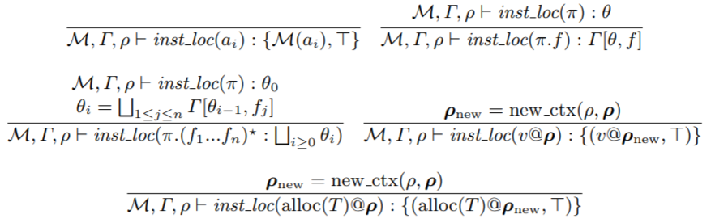

<div align = "center">Figure 5: Instantiation of memory locations</div> 

The rules above produce judgment of the form $M,\Gamma,\rho \vdash inst\_loc(\pi) : \theta$ where $M$ maps formals to actuals, and $\Gamma$ and $\rho$ are the abstract heap and program point associated with a call site respectively. The form means that: Under $M,\Gamma,\rho$, location $\pi$ used in the summary maps to location set $\theta$.

Rule 1 maps formal parameter $a_i$ to the actual $M(a_i)$.

Rule 2 instantiates argument-derived locations of the form $\pi.f$.

Rule 3 instantiates access paths f the form $\pi.(f_1,f_2,...,f_n)^*$. It gets all locations that are reachable from $\theta_0$ using any combination of field selectors $f_1,f_2,...,f_n$.

Rule 4 and rule 5 describes the instantiation of allocations and local variables. $new\_ctx$ gets a new context in a `k-limiting` way:

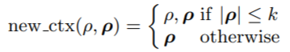

Here $\rho$ is the current call site and $\mathbf{\rho}$ in bold is the current context of call string.

### Constraints

The instantiation of constraints is summarized in Figure 6.

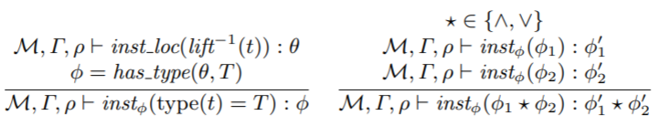

<div align = "center">Figure 6: Instantiation of constraints</div>

To solve a constraint $type(t) = T$, we map $t$ to its corresponding location set $\theta$ by using $inst\_loc$ and leverages function $has\_type$ to yield the condition.

### Abstract Heap

Figure 7 shows how to instantiate an abstract heap $\Delta$.

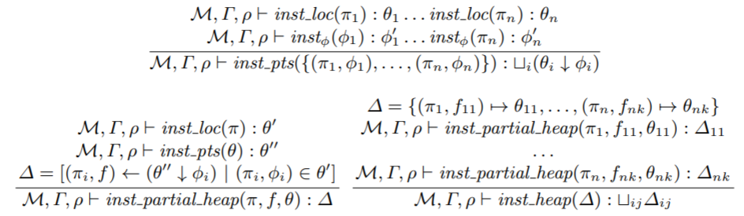

<div align = "center">Figure 7: Instantiation of abstract heap</div>

### Method Calls

Figure 8 shows the analysis of method calls.

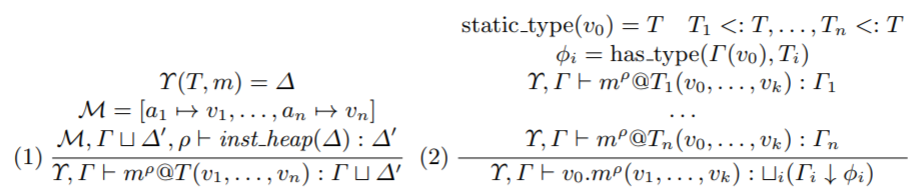

<div align = "center">Figure 8: Analysis of method calls</div>

