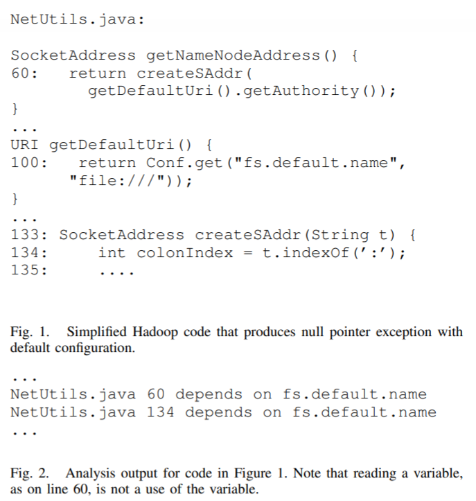
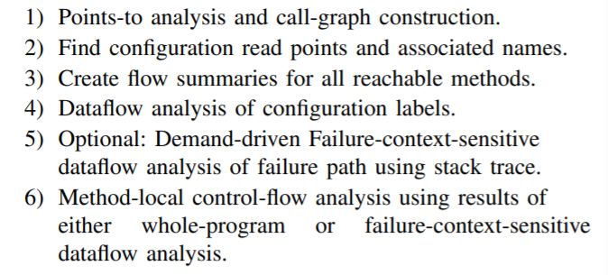

# Precomputing Possible Configuration Error Diagnoses

[toc]

This note is the summary of paper [Precomputing Possible Configuration Error Diagnoses](http://citeseerx.ist.psu.edu/viewdoc/download?doi=10.1.1.446.7705&rep=rep1&type=pdf).

## Introduction

In software configuration, this paper demonstrates how to build a map from each program point to the options that might cause an error at that point.

For example, if there is en error message such as `NullPointerException at line 134 of NetUtils.java`, this approach points them to a configuration option that, if changed, will make the error go away.

The chief tool is static analysis( failure-context-sensitive analysis, FCS), which can be done independent of the user's query.

## FCS

FCS re-analyzes the call chain corresponding to the stack trace, pruning out irrelevant paths. By reusing the results from a prior static analysis, the run time for FCS can be kept low.

In systems such as Hadoop, data may flow in and out of the system via network and filesystem, so it is difficult to capture dynamically and there exists some imprecision.

## Model

We model configurations as a set of key-value pairs, where the keys are strings and the values have arbitrary type.

### Crash example:

One crash example is shown in Figure 1.

Figure 1: A crash example

In method `getNameNodeAddress()`, it attempts to construct an address whose parameter is a string generated from method `getDefaultUri()`. However, method `getDefaultUri()` can only return a `null` in this case, and the crash will finally happen in line 134 in method `createSAddr()`. This crash entails three classes and it is hard to debug.

In our approach, we build a table mapping each line in program to the options most associated with it. In this example, it will show that `fs.default.name` affects line 134 of `NetUtils.java`.

The analysis marks the call to `Conf.get()` as an option read. Its return value is therefore assigned the label `fs.default.name`. Dataflow analysis tracks the flow of this label into `reateSAddr()`. Line 134 of `NetUtils.java` uses this value, and so the analysis outputs that the line in question depends on `fs.default.name`.

Our analysis does not tell users what value for the option will resolve the problem, but it can avoid wasted time tinkering with irrelevant options.

### Approach

The approach is show in Figure 2.

Figure 2: Approach

Step (1) to (4) can be down statically.

#### heuristics:

* We cannot assume that analysis will find an allocation site for every object.

  Objects can be allocated in native code or in user code not present at analysis time. Hence, we apply labels to variables and to fields of objects, not to allocation sites. 

* we do not analyze inside the standard library. 

  Instead, we treat library methods as opaque and treat references to library-defined types as primitives.

### Implementation

#### Static Analysis

##### Points-to Analysis

We used the k-object-sensitive points-to analysis built into `JChord` (with k = 2). The analysis is field-sensitive, path insensitive, and flow insensitive.

To incorporate remotely invoked methods into our points-to analysis, we automatically generate Java stubs that call each remotely accessible method of a server object. **???**

##### Finding Configuration

Each of the applications we examined used a handful of “configuration” classes (often with that name) responsible for reading a configuration file and exposing a key-value interface to the rest of the program.

Configuration is typically spread across several domains: an environment variable named `someOption` may have no connection to a JVM property of the same name.

##### Dataflow

As noted above, we use an object-sensitive dataflow analysis. This decreased false positives by 40% compared to context-insensitive analysis.

We mark a method’s return value as depending on an argument if there is a control-dependency between the return statement and the argument.

If two variables may be aliased locally, we propagate labels from one to the other.  If a local variable aliases a static or instance field, and that variable becomes tainted via a library call, we taint the field.

we do not model arbitrary interprocedural aliasing since it is not frequent in Java.

##### Summarization

We use a summary-based context-sensitive analysis to gain additional precision.

When a label can flow from a method argument to its return value without going through the heap, we mark the method as having a functional dependence on the argument. Then, on the caller side, we use this summary to model the behavior of the function with respect to its arguments.

This summary-based method can make the dataflow more precise and faster.

##### Library Modeling

Library modeling is necessary because it can reduce the size of the code that needs to be analyzed and gain the effect of an extra level of context-sensitivity for library calls.

We assume that if a parameter to an API call depends on a configuration option, then the object on which it is invoked and the return value both also depend on that option.

##### Control Dependence

We have explored alternative slicing approaches that included additional implicit flows; these caused only small changes to our results. 

The final output at each program point is the union of control and data dependencies at that point.

#### FCS

Failure-context-sensitive analysis (FCS) is the technique for using stack traces to refine the precision of our error diagnosis.

#### Dynamic Approaches

##### instrumented configuration reads

The value of a configuration option that is never read cannot affect the program. Therefore, this method records which options are read and where.

##### instrumented configuration flow

In addition to dynamically monitoring option reads, we track the flow of labeled objects through the program dynamically. 

.When a configuration value is returned by a method, that value and the associated option name are recorded in a lookup table. This table is kept in the memory of the instrumented process. 

At each new invocation, the options associated with each parameter are written to disk.
