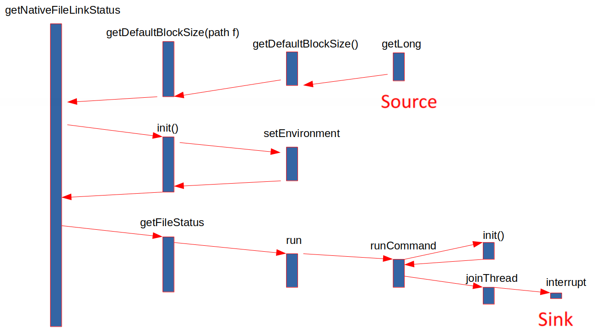

# Non-deterministic Path Analysis

[toc]

## Overview

After `cFlow` has analyzed an application and reconstructed paths from the taint propagation graph, we can find non-deterministic path. That means if we run `cFlow` to analyze the same application in the same environment for several times, we may get different results.

This is really strange and annoying! I run `cFlow` on the application of `hadoop_common` and have found a non-deterministic path, as shown in the analysis in [Example](#example) below. After debugging on that case, I've finally got the reason behind it: In the process of `dfs` during path reconstruction stage, `cFlow` needs to explore the successors of a taint which are stochastically sorted in a list. Actually, successors are stochastically sorted due to **(1)** the random feature of `Soot ForwardFlowAnalysis` framework and **(2)** the lack of information for comparison. Since the selection of successors is not deterministic, it can contribute to different searching sequences of taint propagation paths, thus causing the non-deterministic paths at last.

Since it is not easy to change the attribute of `Soot`, I can only add more information for the statement in each taint. I simply add a `count` to each statement, which acts as an "ID" to distinguish the statements with the same string representation. After this encapsulation, the problem of non-deterministic path is solved, but `cFlow` would take more time to finish the whole analysis.

This report is organized as follows:

* [Example](#example) discusses an example of non-deterministic path, which is an entry point for me to debug.
* [Reason](#reason) demonstrates the reason for non-deterministic path in `cFlow`.
* [Solution](#solution) explains the simple solution to this problem.
* [Test Result](#test result) shows the testing result on my solution.
* [Summary](#summary) summarizes the problem and solution.
* [Appendix](#appendix) adds some detail information of debugging.

## Example

Here is the example of non-deterministic paths in `cFlow`.

### Environment

I test `cFlow` on `ubuntu 20.04`, with `java 1.8.0_291` and `maven-3.6.3`.

I analyze the source code of `hadoop_common 3.3.0`(available [here](https://hadoop.apache.org/release/3.3.0.html))

At the root directory of `cFlow`, I firstly run the command

```bash
./run.sh -a hadoop_common -i -s
```

twice and record the output of the taint path.

Then I compare those two output files( I name them as `a.txt` and `b.txt`) and get some slight difference: `a.txt` has 28738 lines and `b.txt` has 28746 lines. I will analyze this difference in the following part.

### Source

At line 3041 of file `a.txt`, here is the source:

```java
Source: $l0 in $l0 = virtualinvoke $r1.<org.apache.hadoop.conf.Configuration: long getLong(java.lang.String,long)>("fs.local.block.size", 33554432L) in method <org.apache.hadoop.fs.FileSystem: long getDefaultBlockSize()> reaches:
```

which is in method `getDefaultBlockSize()`

```java
public long getDefaultBlockSize()
    {
        org.apache.hadoop.fs.FileSystem r0;
        org.apache.hadoop.conf.Configuration $r1;
        long $l0;

        ...

        $l0 = virtualinvoke $r1.<org.apache.hadoop.conf.Configuration: long getLong(java.lang.String,long)>("fs.local.block.size", 33554432L);

        return $l0;
    }
```

in `org.apache.hadoop.fs.FileSystem.jimple`.

And in the source code of `Hadoop-3.3.0`, this method is located in `hadoop-common/src/main/java/org/apache/hadoop/fs/FileSystem.java`

```java
@Deprecated
  public long getDefaultBlockSize() {
    // default to 32MB: large enough to minimize the impact of seeks
    return getConf().getLong("fs.local.block.size", 32 * 1024 * 1024);
  }
```

### Sink

at line 3065 in file `a.txt` and file `b.txt`, we can see that they have the same sink:

``` java
-- Sink r0.<org.apache.hadoop.util.Shell$1: org.apache.hadoop.util.Shell this$0> in virtualinvoke r0.<java.lang.Thread: void interrupt()>() in method <org.apache.hadoop.util.Shell: void joinThread(java.lang.Thread)> along:
```

which is in method `joinThread()` in

```java
private static void joinThread(java.lang.Thread)
    {
        java.lang.Thread r0;
        java.lang.Throwable $r1;
        org.slf4j.Logger $r3, $r5;
        boolean $z0, $z1;
        java.lang.StringBuilder $r4, $r6, $r7;
        java.lang.String $r8;

        r0 := @parameter0: java.lang.Thread;

     ...

     label5:
        virtualinvoke r0.<java.lang.Thread: void interrupt()>();

        goto label1;

    ...
    }
```

in `org.apache.hadoop.util.Shell.jimple`.

And in the source code of `Hadoop-3.3.0`, this method is located in `hadoop-common/src/main/java/org/apache/hadoop/util/Shell.java`

```java
private static void joinThread(Thread t) {
    while (t.isAlive()) {
      try {
        t.join();
      } catch (InterruptedException ie) {
        if (LOG.isWarnEnabled()) {
          LOG.warn("Interrupted while joining on: " + t, ie);
        }
        t.interrupt(); // propagate interrupt
      }
    }
  }
```


### Expected Taint Propagation

From the source code of `hadoop-common-3.3.0`, we can find the **expected** taint propagation path as below. 

Figure 1 shows the summary of this actual taint propagation path, which is similar to an activation tree. For simplicity, I only draws the **interprocedural** taint propagation. Here is the brief description of Figure 1.

* Rectangles in blue represent procedures in execution. For example, method `getNativeFileLinkStatus` first calls method `getDefaultBlockSize`, then calls method `init()` and `getFileStatus`. 
* Arrows in red mark interprocedural taint propagation. As we can see, taint comes from method `getLong` (as source), and then goes to method  `getNativeFileLinkStatus` by procedure return, and finally goes to method `interrupt`(as sink) by procedure call.



<div align = "center">Figure 1: summary of expected taint propagation path and that of a.txt</div>  																			

For more detailed information about expected taint propagation path, please see [Detail](#detail(expected)) in Appendix part.

### Received Taint Propagation

Here I trace this taint propagation from the output file which is named as `a.txt` and `b.txt`.

The summary of **received** taint propagation path of output file `a.txt` is the same as that shown in Figure 1. However, the summary of **received** taint propagation path of output file `b.txt` is shown in Figure 2, which is sightly different from Figure 1.


<div align = "center">Figure 2: summary of taint propagation path of b.txt</div>

In `b.txt`, the taint propagates through method `joinThread` twice before it reaches the sink(as shown in Figure 2). However, in `a.txt`, the taint propagates through method `joinThread` once before it reaches the sink(as shown in Figure 1). 

For more detailed information about received taint propagation path, please see [Detail](#detail(received)).

### Reason

#### Approach

In order to find the reason, I adjust the code in file `SourceSinkConnectionVisitor.java` to print all paths between a pair of source and sink.

Also, I change `SourceSinkManager.java` to only focus on the source of `getLong` and the sink of `interrupt`(In order to simplify debugging).

I have found that the taint propagation path prior to method `runCommand` is the same, so I only focus on method `runCommand`, `joinThread` and `interrupt`.

#### Logic structure

The brief logic structure of method `runCommand` and `joinThread` in `Jimple` is respectively shown in Figure 3 and Figure 4.


<div align = "center">Figure 3: logic structure of method runCommand</div>


<div align = "center">Figure 4: logic structure of method joinThread</div>

Figure 3 and Figure 4 only focus on the control flow of method `runCommand`, `joinThread` and`interrupt`. So they leave out some trivial details. In Figure 3, `Label 23`  and `Label 34` share the same static code in `Finally` statement, and they can be reached by `Label 18` without catching exception and by catching exception, respectively. 

#### Expected Output

Therefore, in method `runCommand`, we can reach sink `interrupt` in the following five ways:

1. calling `joinThread` at `Label 18`, then calling `interrupt` in `joinThread`.
2. calling `joinThread` at `Label 18`, then returning from `joinThread`, later calling `interrupt` at `label 23`.
3. calling `joinThread` at `Label 18`, then returning from `joinThread`, later calling `interrupt` at `label 34`.
4. calling `joinThread` at `Label 18`, then returning from `joinThread`, later calling `joinThread` at `label 23`, and finally calling `interrupt` in `joinThread`.
5. calling `joinThread` at `Label 18`, then returning from `joinThread`, later calling `joinThread` at `label 34`, and finally calling `interrupt` in `joinThread`.

Those five ways are shown in Figure 5. Lines in different colors represent different propagation paths. The sequence number of each path is also marked near the corresponding path.


<div align = "center">Figure 5: all expected taint propagation paths</div>

In order to mark the context of the statements that call those methods, I record the hash code of the invoke statement of `joinThread` in `Label 18`, `Label 23` and `Label 34` as well as the invoke statement of `interrupt` in `Label 5`, `Label 23` and `Label 34`. So I can trace a more precise context of each taint when I am analyzing an output file. 

#### Actual Output

Here I choose two different output: `a1.txt` and `b1.txt`.

##### 1. `a1.txt`

`a1.txt` shows that the actual taint propagation paths are:

1. calling `joinThread` at `Label 34`, then calling `interrupt` in `joinThread`.
2. calling `joinThread` at `Label 18`, then returning from `joinThread`, later calling `joinThread` at `label 23`, and finally calling `interrupt` in `joinThread`.
3. calling `joinThread` at `Label 18`, then returning from `joinThread`, later calling `interrupt` at `label 34`.
4. calling `joinThread` at `Label 18`, then returning from `joinThread`, later calling `interrupt` at `label 23`.
5. calling `joinThread` at `Label 18`, then calling `interrupt` in `joinThread`.

Those five taint propagation paths are shown in Figure 6.


<div align = "center">Figure 6: all taint propagation paths in a1.txt

##### 2. `b1.txt`

`b1.txt` shows that the actual taint propagation paths are:

1. calling `joinThread` at `Label 18`, then returning from `joinThread`, later calling `joinThread` at `label 34`, and finally calling `interrupt` in `joinThread`.
2. calling `joinThread` at `Label 18`, then returning from `joinThread`, later calling `joinThread` at `label 23`, and finally calling `interrupt` in `joinThread`.
3. calling `joinThread` at `Label 18`, then returning from `joinThread`, later calling `interrupt` at `label 23`.
4. calling `joinThread` at `Label 18`, then returning from `joinThread`, later calling `interrupt` at `label 34`.
5. calling `joinThread` at `Label 18`, then calling `interrupt` in `joinThread`.

Those five taint propagation paths are shown in Figure 7.


<div align = "center">Figure 7: all taint propagation paths in b1.txt

##### Result

If we compare Figure 5, 6 and 7, we can find that

* Figure 5 and Figure 7 share the same set of propagation paths, which means that `b1.txt` is the same as expectation.
* Path 1 in Figure 6 is different from path 1 in Figure 7, which is the only difference between Figure 6 and Figure 7. To be specific, path 1 in Figure 6 skips `Label 18`. Since originally `Label 18` is in `try` block and `Label 34` is in `finally` block, any path that reaches `Label 34` should have gone through `Label 18`, which makes path 1 in Figure 6 is counterintuitive.(Maybe it depends on the feature of `Soot`?) 

## Reason

I use `IntelliJ IDEA` to trace the process of path reconstruction and have found the reason for this difference.

When the current taint is 

```java
r24.<org.apache.hadoop.util.Shell$1: org.apache.hadoop.util.Shell this$0> in r24 = $r87 in method <org.apache.hadoop.util.Shell: void runCommand()>
```

In one case, the sorted list `successors` in `dfs` is as Figure 8:


<div align = "center">Figure 8: successors in dfs in one case

Note that the identity hash code of `stmt` in `successors[0]` and `successors[1]` is 1864693811 and 564764701. According to the map from statement to identity hash code in Figure 9, `successors[0]` is at the statement of `label 34` and `successors[1]` is at the statement of `label 18` . So it searches `joinThread` at `Label 34` before searching `joinThread` at `Label 18`, thus resulting in the output of `a1.txt`. 


<div align = "center">Figure 9: map from statement to identity hash code in one case

However, in another case , the sorted list `successors` in `dfs` is as Figure 10:


<div align = "center">Figure 10: successors in dfs in another case

Note that the identity hash code of `stmt` in `successors[0]` and `successors[1]` is 564764701 and 1864693811. According to the map from statement to identity hash code in Figure 11(it looks the same as Figure 9 by coincidence), `successors[0]` is at the statement of `label 18` and `successors[1]` is at the statement of `label 34` . So it searches `joinThread` at `Label 18` before searching `joinThread` at `Label 34`, thus resulting in the output of `b1.txt`. 


<div align = "center">Figure 11: map from statement to identity hash code in another case

Actually, there is no difference between the string representation of taint `successors[0]` and `successors[1]`, since their `transferType`, `plainValue`, `field`, string representation of `stmt` and string representation of `method` are all the same. Since we use

```java
successors.sort(Comparator.comparing(Taint::toString));
```

to sort `successors` in a **stable** way, Their sequence is dependent on when they are appended into `successors` by `Soot`.

The non-deterministic sequence in `Successors` causes different searching sequences. Note that in `SourceSinkConnectionVisitor.java`,  `visitedStack` is used to avoid repetitious visit to one taint in the same procedure. Therefore, different searching sequences may cause different searching paths. For example, in Figure 6, since invoke statement of `joinThread` at `Label 34` is first searched in method `runCommand`, it will not search that statement after searching `interrupt` at `Label 34` and form path 1 in Figure 7(and vice versa).

To sum up, it is **the randomness of `Soot`**  and **the lack of context information for comparison** that contribute to the non-deterministic path.

## Solution

### New encapsulation

Since it is not easy to change the feature of `Soot`, we may try to add more information for each statement. Here, I encapsulate each statement with its sequence number as `UniqueStmt`(shown in Figure ), which means that those statements are distinct in comparison.


<div align = "center"> Figure : class of UniqueStmt

To be specific, for statements with the same `toString()` , I use a counter to record their sequence to be visited and get their sequence number. For example, for invoke statement of method `joinThread`, since `Label 18` is visited before `Label 23` and `Label 23` is visited before `Label 34`,  I set the sequence number of the invoke statement of `joinThread` at `Label 18` , `Label 23` and `Label 34` as 1, 2, 3, respectively.

In order to maintain the counter of each statement and get the count correctly, I use three data structures in `TaintFlowAnalysis`:

* `Map<String, Integer> stmtStrCounter` acts as a counter for each string representation of a statement. It can get the existing number of distinct statements sharing the key string, so it is easy to get the `count` of a statement. 
* `Map<Stmt, Integer> countedStmtCache` acts as a cache to store the `count` of each statement. It can check whether a statement is recorded, thus it helps avoid counting repetitious statement. 
* `Map<UniqueStmt, UniqueStmt> uniqueStmtCache` acts as a cache to store each generated object of `UniqueStmt`. Like `taintCache`, it can reduce the repetitious objects and save memory. 

### New method

Therefore, I define a method `generateUniqueStmt` to construct the corresponding `UniqueStmt` given `stmt` and `count`. 

* Firstly, it uses `countedStmtCache` to check whether `stmt` is counted. If so, it can get the `count` easily. If not, it can use `stmtStrCounter` to get the `count` for that `stmt`.
* Secondly, it constructs a `UniqueStmt` object based on `stmt` and `count`, and it checks whether that object has been stored in `uniqueStmtCache`. If so, it uses the one in `uniqueStmtCache` to substitute that object. If not, it adds the object into `uniqueStmtCache`. 

```java
/**
     * generate UniqueStmt of stmt with count based on stmtStrCounter, countedStmtCache and uniqueStmtCache
     * Basically, we will get the count id of that statement from stmtStrCounter and countedStmtCache
     * Then, we will generate the UniqueStmt with the help of uniqueStmtCache
     * @param stmt      the current statement
     * @return          the UniqueStmt of (stmt, count)
     */
    private UniqueStmt generateUniqueStmt(Stmt stmt) {

        // set the original default count as -1
        Integer count = -1;
        // the string format of that statement
        String stmtStr = stmt.toString();

        // that stmt has been counted, we don't need to count it again
        if (countedStmtCache.containsKey(stmt)) {
            count = countedStmtCache.get(stmt);
        }
        // the stmt hasn't been counted, find the count in stmtStrCounter
        else {
            // the string of that statement has been counted,
            // so we get the new count by simply incrementing it
            // and record it into stmtStrCounter
            if (stmtStrCounter.containsKey(stmtStr)) {
                count = stmtStrCounter.get(stmtStr);
                count = count + 1;
                stmtStrCounter.put(stmtStr, count);
            }
            // the string of that statement hasn't been counted
            // so we set the new count as 1
            // and record it into stmtCounter
            else {
                count = 1;
                stmtStrCounter.put(stmtStr, count);
            }
            // store the count id of that statement into countedStmtCache
            countedStmtCache.put(stmt, count);
        }

        // generate a new UniqueStmt
        UniqueStmt uniqueStmt = new UniqueStmt(stmt, count);

        // the uniqueStmt has been stored in uniqueStmtCache, just get it from uniqueStmtCache
        if (uniqueStmtCache.containsKey(uniqueStmt)) {
            uniqueStmt = uniqueStmtCache.get(uniqueStmt);
        }
        // the uniqueStmt has been stored in uniqueStmtCache, just put it into uniqueStmtCache
        else {
            uniqueStmtCache.put(uniqueStmt, uniqueStmt);
        }

        return uniqueStmt;
    }
```

`cFlow` calls `generateUniqueStmt` when

* visiting a statement in method `flowThrough` 
* creating a `UniqueStmt` for a `PhantomIdentityStmt` and `phantomRetStmt`.

### Other changes

In `cFlow`, I change all parameters of class `Stmt` to `UnqinueStmt` for context precision. In method `dfs`, I change 

```java
successors.sort(Comparator.comparing(Taint::toString));
```

to

```java
successors.sort(Comparator.comparing(Taint::toString).thenComparing(Taint::getCount));
```

  to make the comparison more effective.

To sum up, I consider the count number of each statement to make each statement distinct in comparison. Therefore, the sequence of `dfs` is deterministic. However, recording the count for each statement require us to maintain three data structures, which may cause some cost of performance.

## Test Result

I write a script to execute

```bash
./run.sh -a hadoop_common -i -s
```

for 10 times and compare the output result to check difference.

And the output result shows that there is no difference.

(All output files contain 28746 lines and they only differ in execution time)

```bash
############################################
###           start checking             ###
############################################
no difference.
```

Compared to the result before the change, the number of iteration to build taint propagation graph is the same(29 iters). However, the new result shows that the average time spent for the whole process is about 3min 20s, which is far more than original one(50s). That may be caused by calling `generateUniqueStmt` every time in `flowThrough`. 

## Summary

The reason for the non-deterministic taint propagation path is due to the stochastic feature of `Soot` and the lack of context information of each statement. To cope with this problem, I add a `count` for each statement. Therefore, the comparison in `dfs` is deterministic and so does the result. However, this change sacrifices the performance, as is shown that the time spent(3min 20s) is four times as the original one(50s).

## Appendix

### Detail(expected)

Here I show the detailed traceback of expected taint propagation path. 

1. `getLong()` in `getDefaultBlockSize()` at line 2602 in `src/main/java/org/apache/hadoop/util/FileSystem.java`.

   ```java
   @Deprecated
     public long getDefaultBlockSize() {
       // default to 32MB: large enough to minimize the impact of seeks
       return getConf().getLong("fs.local.block.size", 32 * 1024 * 1024);
     }
   ```

2. return from `getDefaultBlockSize()` at line 2612 in `src/main/java/org/apache/hadoop/util/FileSystem.java`.

   ```java
   public long getDefaultBlockSize(Path f) {
       return getDefaultBlockSize();
     }
   ```

3. `stat` in `getNativeFileLinkStatus()` at line 1051 in `src/main/java/org/apache/hadoop/util/RawLocalFileSystem.java`.

   ```java
   private FileStatus getNativeFileLinkStatus(final Path f,
         boolean dereference) throws IOException {
       checkPath(f);
       Stat stat = new Stat(f, getDefaultBlockSize(f), dereference, this);
       FileStatus status = stat.getFileStatus();
       return status;
     }
   ```

4. `stat`(this object) in `getFileStatus()`  at line 73 in `src/main/java/org/apache/hadoop/util/RawLocalFileSystem.java`.

   ```java
   public FileStatus getFileStatus() throws IOException {
       run();
       return stat;
     }
   ```

5. this object in `run()` at line 893 in `src/main/java/org/apache/hadoop/util/Shell.java`.

   ```java
   protected void run() throws IOException {
       if (lastTime + interval > Time.monotonicNow()) {
         return;
       }
       exitCode = 0; // reset for next run
       if (Shell.MAC) {
         System.setProperty("jdk.lang.Process.launchMechanism", "POSIX_SPAWN");
       }
       runCommand();
     }
   ```

6. this object in `runCommand()`: at line 905 in `src/main/java/org/apache/hadoop/util/Shell.java`.

   ```java
   private void runCommand() throws IOException {
       ...
       try {
         ...
         joinThread(errThread);
         completed.set(true);
         //the timeout thread handling
         //taken care in finally block
         if (exitCode != 0) {
           throw new ExitCodeException(exitCode, errMsg.toString());
         }
       } catch (InterruptedException ie) {
         InterruptedIOException iie = new InterruptedIOException(ie.toString());
         iie.initCause(ie);
         throw iie;
       } finally {
         if (timeOutTimer != null) {
           timeOutTimer.cancel();
         }
         // close the input stream
         try {
           inReader.close();
         } catch (IOException ioe) {
           LOG.warn("Error while closing the input stream", ioe);
         }
         if (!completed.get()) {
           errThread.interrupt();
           joinThread(errThread);
         }
         try {
           errReader.close();
         } catch (IOException ioe) {
           LOG.warn("Error while closing the error stream", ioe);
         }
         process.destroy();
         waitingThread = null;
         CHILD_SHELLS.remove(this);
         lastTime = Time.monotonicNow();
       }
     }
   ```

7. `errThread` in its constructor at line 961 in `src/main/java/org/apache/hadoop/util/Shell.java`, which sets this object as its parameter

   ```java
   Thread errThread = new Thread()
   ```

8. `errThread` as a parameter when calling `joinThread()` at line 1003 or 1026 in `src/main/java/org/apache/hadoop/util/Shell.java`.

   ```java
   joinThread(errThread);
   ```

9. reaches `sink` in `joinThread()`

   ```java
   private static void joinThread(Thread t) {
       while (t.isAlive()) {
         try {
           t.join();
         } catch (InterruptedException ie) {
           if (LOG.isWarnEnabled()) {
             LOG.warn("Interrupted while joining on: " + t, ie);
           }
           t.interrupt(); // propagate interrupt
         }
       }
     }
   ```

### Detail(received)

Here I show the detailed traceback of received taint propagation path in `a.txt` and `b.txt`.

In file `a.txt`, we can see the taint propagation from this source to sink is

1. **(line 3066)** `Source`, `$l0` is tainted by getter method `getLong()`.

   ```java
   $l0 = virtualinvoke $r1.<org.apache.hadoop.conf.Configuration: long getLong(java.lang.String,long)>("fs.local.block.size", 33554432L);
   ```

2. **(line 3067)** `$l0` in return statement

   ```java
   -> [Return] $l0 in $l0 = virtualinvoke r0.<org.apache.hadoop.fs.FileSystem: long getDefaultBlockSize()>() in method <org.apache.hadoop.fs.FileSystem: long getDefaultBlockSize(org.apache.hadoop.fs.Path)>
   ```

   in method `getDefaultBlockSize()`

   ```java
       public long getDefaultBlockSize(org.apache.hadoop.fs.Path)
       {
           org.apache.hadoop.fs.FileSystem r0;
           long $l0;
           org.apache.hadoop.fs.Path r1;
   
           r0 := @this: org.apache.hadoop.fs.FileSystem;
   
           r1 := @parameter0: org.apache.hadoop.fs.Path;
   
           $l0 = virtualinvoke r0.<org.apache.hadoop.fs.FileSystem: long getDefaultBlockSize()>();
   
           return $l0;
       }
   ```

   in `org.apache.hadoop.fs.FileSystem.jimple`.

   which is 

   ```java
   public long getDefaultBlockSize(Path f) {
       return getDefaultBlockSize();
     }
   ```

    in `hadoop-common/src/main/java/org/apache/hadoop/fs/FileSystem.java`.

   

3. **(line 3068)** `$l0` as a return value in return statement

   ```java
      -> [Return] $l0 in $l0 = virtualinvoke r0.<org.apache.hadoop.fs.RawLocalFileSystem: long getDefaultBlockSize(org.apache.hadoop.fs.Path)>(r1) in method <org.apache.hadoop.fs.RawLocalFileSystem: org.apache.hadoop.fs.FileStatus getNativeFileLinkStatus(org.apache.hadoop.fs.Path,boolean)>
   ```

   which is at line 2414 

   ```java
   $l0 = virtualinvoke r0.<org.apache.hadoop.fs.RawLocalFileSystem: long getDefaultBlockSize(org.apache.hadoop.fs.Path)>(r1);
   ```

   in method 

   ```java
   private org.apache.hadoop.fs.FileStatus getNativeFileLinkStatus(org.apache.hadoop.fs.Path, boolean) throws java.io.IOException
   ```

   which is located in `org.apache.hadoop.fs.RawLocalFileSystem.jimple`.

4. **(line 3069)** `$l0` as a parameter in the invoke statement in the same method as the last taint.

   ```java
       -> [Call] $l0 in specialinvoke $r2.<org.apache.hadoop.fs.Stat: void <init>(org.apache.hadoop.fs.Path,long,boolean,org.apache.hadoop.fs.FileSystem)>(r1, $l0, z0, r0) in method <org.apache.hadoop.fs.RawLocalFileSystem: org.apache.hadoop.fs.FileStatus getNativeFileLinkStatus(org.apache.hadoop.fs.Path,boolean)>
   ```

   which is at line 2416

   ```java
   specialinvoke $r2.<org.apache.hadoop.fs.Stat: void <init>(org.apache.hadoop.fs.Path,long,boolean,org.apache.hadoop.fs.FileSystem)>(r1, $l0, z0, r0);
   ```

5. **(line 3070)** `r0.<org.apache.hadoop.fs.Stat: long blockSize>`  in assign statement

   ```java
       -> r0.<org.apache.hadoop.fs.Stat: long blockSize> in r0.<org.apache.hadoop.fs.Stat: long blockSize> = l0 in method <org.apache.hadoop.fs.Stat: void <init>(org.apache.hadoop.fs.Path,long,boolean,org.apache.hadoop.fs.FileSystem)>
   ```

   which is at line 71 

   ```java
   r0.<org.apache.hadoop.fs.Stat: long blockSize> = l0;
   ```

   in method 

   ```java
   public void <init>(org.apache.hadoop.fs.Path, long, boolean, org.apache.hadoop.fs.FileSystem) throws java.io.IOException 
   ```

   in `org.apache.hadoop.fs.Stat.jimple`.

   (Since `$l0` is a tainted parameter in that method)

6. **(line 3071)** `r0.<org.apache.hadoop.fs.Stat: long blockSize>` as a base object in invoke statement

   ```java
       -> [Call] r0.<org.apache.hadoop.fs.Stat: long blockSize> in virtualinvoke r0.<org.apache.hadoop.fs.Stat: void setEnvironment(java.util.Map)>(r19) in method <org.apache.hadoop.fs.Stat: void <init>(org.apache.hadoop.fs.Path,long,boolean,org.apache.hadoop.fs.FileSystem)>
   ```

   which is at line 81 of method

   ```java
   virtualinvoke r0.<org.apache.hadoop.fs.Stat: void setEnvironment(java.util.Map)>($r18);
   ```

   in the same method as the last taint.

7. **(line 3072)** `r0.<org.apache.hadoop.fs.Stat: long blockSize>`  as a base object in return statement

   ```java
       -> [Return] r0.<org.apache.hadoop.fs.Stat: long blockSize> in virtualinvoke r0.<org.apache.hadoop.fs.Stat: void <init>(org.apache.hadoop.fs.Path,long,boolean,org.apache.hadoop.fs.FileSystem)>(r19) in method <org.apache.hadoop.fs.Stat: void <init>(org.apache.hadoop.fs.Path,long,boolean,org.apache.hadoop.fs.FileSystem)>
   ```

   at the same site. **? why doesn't it dive deeper into `setEnvironment` and the parameter is r19 ?** Maybe because the `Jimple` being analyzed is not optimized.

8. **(line 3073)** `$r2.<org.apache.hadoop.fs.Stat: long blockSize>` as a base object in return statement

   ```java
       -> [Return] $r2.<org.apache.hadoop.fs.Stat: long blockSize> in specialinvoke $r2.<org.apache.hadoop.fs.Stat: void <init>(org.apache.hadoop.fs.Path,long,boolean,org.apache.hadoop.fs.FileSystem)>(r1, $l0, z0, r0) in method <org.apache.hadoop.fs.RawLocalFileSystem: org.apache.hadoop.fs.FileStatus getNativeFileLinkStatus(org.apache.hadoop.fs.Path,boolean)>
   ```

   at line 2416 in method

   ```java
   private org.apache.hadoop.fs.FileStatus getNativeFileLinkStatus(org.apache.hadoop.fs.Path, boolean) throws java.io.IOException
   ```

   in `org.apache.hadoop.fs.RawLocalFileSystem.jimple`.

   It means that the base object is tainted by the parameter.

9. **(line 3074)** I haven't seen the assignment of `r3 = $r2` in the `Jimple` code, maybe it has gone through some `copy propagation` optimization.

   ```java
       -> r3.<org.apache.hadoop.fs.Stat: long blockSize> in r3 = $r2 in method <org.apache.hadoop.fs.RawLocalFileSystem: org.apache.hadoop.fs.FileStatus getNativeFileLinkStatus(org.apache.hadoop.fs.Path,boolean)>
   ```

10. **(line 3075)**  `r3.<org.apache.hadoop.fs.Stat: long blockSize>` in the assign statement

    ```java
        -> [Call] r3.<org.apache.hadoop.fs.Stat: long blockSize> in r4 = virtualinvoke r3.<org.apache.hadoop.fs.Stat: org.apache.hadoop.fs.FileStatus getFileStatus()>() in method <org.apache.hadoop.fs.RawLocalFileSystem: org.apache.hadoop.fs.FileStatus getNativeFileLinkStatus(org.apache.hadoop.fs.Path,boolean)>
    ```

    which is at line 2418 in method 

    ```java
    private org.apache.hadoop.fs.FileStatus getNativeFileLinkStatus(org.apache.hadoop.fs.Path, boolean) throws java.io.IOException
    ```

    Actually, the assignment after `copy-propagation` optimization is

    ```java
    r4 = virtualinvoke $r2.<org.apache.hadoop.fs.Stat: org.apache.hadoop.fs.FileStatus getFileStatus()>();
    ```

    So the taint should be `r4.<org.apache.hadoop.fs.Stat: long blockSize>`.

11. **(line 3076)**  `r0.<org.apache.hadoop.fs.Stat: long blockSize>` as base object in invoke statement

    ```java
        -> [Call] r0.<org.apache.hadoop.fs.Stat: long blockSize> in virtualinvoke r0.<org.apache.hadoop.fs.Stat: void run()>() in method <org.apache.hadoop.fs.Stat: org.apache.hadoop.fs.FileStatus getFileStatus()>
    ```

    which is at line 93 in method

    ```java
    public org.apache.hadoop.fs.FileStatus getFileStatus() throws java.io.IOException
    ```

    in `org.apache.hadoop.fs.Stat`. 

12. **(line 3077)**  `r0.<org.apache.hadoop.fs.Stat: long blockSize>` in

    ```java
        -> [Call] r0.<org.apache.hadoop.fs.Stat: long blockSize> in specialinvoke r0.<org.apache.hadoop.util.Shell: void runCommand()>() in method <org.apache.hadoop.util.Shell: void run()>
    ```

    which is at line 1889 in method

    ````java
    protected void run() throws java.io.IOException
    ````

    in `org.apache.hadoop.util.Shell.jimple`.

13. **(line 3078)**  `r1.<org.apache.hadoop.fs.Stat: long blockSize>` as the parameter in invoke statement

    ```java
        -> [Call] r1.<org.apache.hadoop.fs.Stat: long blockSize> in specialinvoke $r81.<org.apache.hadoop.util.Shell$ShellTimeoutTimerTask: void <init>(org.apache.hadoop.util.Shell)>(r1) in method <org.apache.hadoop.util.Shell: void runCommand()>
    ```

    `r1` should be the base object in method `runCommand()`, but I did not show...

14. **(line 3079)**  `r1.<org.apache.hadoop.fs.Stat: long blockSize>` in the return statement

    ```java
        -> [Return] r1.<org.apache.hadoop.fs.Stat: long blockSize> in specialinvoke $r81.<org.apache.hadoop.util.Shell$ShellTimeoutTimerTask: void <init>(org.apache.hadoop.util.Shell)>(r1) in method <org.apache.hadoop.util.Shell: void runCommand()>
    ```

15. **(line 3080)**  `r1.<org.apache.hadoop.fs.Stat: long blockSize>` in invoke statement

    ```java
        -> [Call] r1.<org.apache.hadoop.fs.Stat: long blockSize> in specialinvoke $r87.<org.apache.hadoop.util.Shell$1: void <init>(org.apache.hadoop.util.Shell,java.io.BufferedReader,java.lang.StringBuffer)>(r1, r70, r22) in method <org.apache.hadoop.util.Shell: void runCommand()>
    ```

    the call site

    ```java
    specialinvoke $r87.<org.apache.hadoop.util.Shell$1: void <init>(org.apache.hadoop.util.Shell,java.io.BufferedReader,java.lang.StringBuffer)>(r1, $r83, $r86);
    ```

    is at line 2075 in 

    ```java
    private void runCommand() throws java.io.IOException
    ```

    in `org.apache.hadoop.util.Shell.jimple`.

16. **(line 3081)** in `<init>` method

    ```java
        -> r0.<org.apache.hadoop.util.Shell$1: org.apache.hadoop.util.Shell this$0> in r0.<org.apache.hadoop.util.Shell$1: org.apache.hadoop.util.Shell this$0> = r1 in method <org.apache.hadoop.util.Shell$1: void <init>(org.apache.hadoop.util.Shell,java.io.BufferedReader,java.lang.StringBuffer)>
    ```

17. **(line 3082)**  `$r87.<org.apache.hadoop.util.Shell$1: org.apache.hadoop.util.Shell this$0>`

    ```java
        -> [Return] $r87.<org.apache.hadoop.util.Shell$1: org.apache.hadoop.util.Shell this$0> in specialinvoke $r87.<org.apache.hadoop.util.Shell$1: void <init>(org.apache.hadoop.util.Shell,java.io.BufferedReader,java.lang.StringBuffer)>(r1, r70, r22) in method <org.apache.hadoop.util.Shell: void runCommand()>
    ```

18. **(line 3083)**  `r24.<org.apache.hadoop.util.Shell$1: org.apache.hadoop.util.Shell this$0>` in assign statement

    ```java
         -> r24.<org.apache.hadoop.util.Shell$1: org.apache.hadoop.util.Shell this$0> in r24 = $r87 in method <org.apache.hadoop.util.Shell: void runCommand()>
    ```

19. **(line 3084)**  `r24.<org.apache.hadoop.util.Shell$1: org.apache.hadoop.util.Shell this$0>` as a parameter in invoke statement.

    ```java
        -> [Call] r24.<org.apache.hadoop.util.Shell$1: org.apache.hadoop.util.Shell this$0> in staticinvoke <org.apache.hadoop.util.Shell: void joinThread(java.lang.Thread)>(r24) in method <org.apache.hadoop.util.Shell: void runCommand()>
    ```

20. **(line 3085 in `a.txt`)**   taint `r0.<org.apache.hadoop.util.Shell$1: org.apache.hadoop.util.Shell this$0>` (as a formal parameter) has reached the `sink` at line 2346 in `org.apache.hadoop.util.Shell.jimple`.

    ```java
        -> r0.<org.apache.hadoop.util.Shell$1: org.apache.hadoop.util.Shell this$0> in virtualinvoke r0.<java.lang.Thread: void interrupt()>() in method <org.apache.hadoop.util.Shell: void joinThread(java.lang.Thread)>
    ```

    However, in `b.txt` , we got two more edges in th path between 19 and 20.

21. **(line 3085 in `b.txt`)**

    ```java
    	-> [Return] r24.<org.apache.hadoop.util.Shell$1: org.apache.hadoop.util.Shell this$0> in staticinvoke <org.apache.hadoop.util.Shell: void joinThread(java.lang.Thread)>(r24) in method <org.apache.hadoop.util.Shell: void runCommand()>
    ```

22. **(in line 3086 in `b.txt`)** 

    ```java
        -> [Call] r24.<org.apache.hadoop.util.Shell$1: org.apache.hadoop.util.Shell this$0> in staticinvoke <org.apache.hadoop.util.Shell: void joinThread(java.lang.Thread)>(r24) in method <org.apache.hadoop.util.Shell: void runCommand()>
    ```

I think that is because `a.txt` reaches

```java
staticinvoke <org.apache.hadoop.util.Shell: void joinThread(java.lang.Thread)>($r87);
```

at line 2128 in `org.apache.hadoop.util.Shell.jimple`.

Then it enters the procedure `joinThread()` 

and reaches the `sink` 

```java
        virtualinvoke r0.<java.lang.Thread: void interrupt()>();
```

at line 2346 in `org.apache.hadoop.util.Shell.jimple`, which terminates the propagation.

However, `b.txt` reaches

```java
staticinvoke <org.apache.hadoop.util.Shell: void joinThread(java.lang.Thread)>($r87);
```

at line 2128 in `org.apache.hadoop.util.Shell.jimple`.

Then it enters procedure `joinThread()` and exits from it without reaching the call site of `interrupt()`.

Later, it reaches the call site of `joinThread()` at line 2175 or line 2252. And this visit to `joinThread()` finally helps reach the `sink` in the end.