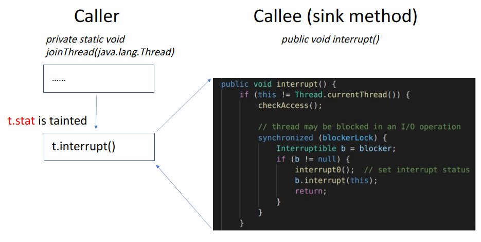

# Further work on improving cflow precision


[toc]

## Introduction

`cflow` is an context- and flow-sensitive static taint analyzer for java application. However, it suffers from some problems such as non-deterministic result and overtainting, which decreases its precision. After fixing the bug of non-determinism, I have found 2 reasons of overtainting: (1) **Getting imprecise callee at call site due to polymorphism** and (2) **ignoring the check of tainted field use in sink method**. 

I will use two examples to show these two reasons.

### Example of reason (1)

Thanks to `RTTI` policy, polymorphism is widely used in Java application. For example, Figure 1 shows a case of polymorphism in `hadoop 3.3.0`.


<div align = "center">Figure 1: An example of polymorphism</div>

In Figure 1, blocks in the left column represents statements in caller and blocks in the right column represents statements in callee; the arrows represents intra- or inter-procedural control flow. Note that `org.apache.hadoop.io.compress.Compressor` is an interface and `org.apache.hadoop.io.compress.zlib.ZlibCompressor` implements this interface. Therefore, variable `r16` is declared as `org.apache.hadoop.io.compress.Compressor` but can invoke method `<org.apache.hadoop.io.compress.zlib.ZlibCompressor: void reinit(org.apache.hadoop.conf.Configuration)>`.

However, based on the intra-procedural context, we can't definitely say that variable `r16` refers to an instance of `org.apache.hadoop.io.compress.zlib.ZlibCompressor`. Therefore, for taint analysis, the callee method may not be that precise, and the result of taint flow is also not that precise.

### Example of reason (2)

`cflow`'s original taint rule at the call site of sink method has imprecision: If the object/field reference of base object/parameters is tainted, then the taint will transfer into sink method. For example, for call site $r = b.m(a_1, a_2)$, if $b$ is tainted or $b.f$ is tainted, then the taint will propagate. In `Hadoop`, this can cause some overtainting(As is shown in Figure 2).



<div align = "center">Figure 2: An example of field use check in sink method</div>

The logic structure of Figure 2 is similar to that of Figure 1. At the call site of sink method `interrupt()`, the field `stat` of base object `t` is tainted. So based on the original taint rule, this taint will propagate into sink method. However, as we check the method body of `interrupt()`, we can find that only `this` is used in statement

```
if (this != Thread.currentThread())
```

and

```
b.interrupt(this);
```

Since we cannot get the body of method `interrupt(Thread)` at call site `b.interrupt(this);`, we can only claim that `t.stat` may be used in sink method `interrupt()`. Therefore, this imprecision can build taints on field reference that is not used in sink method, which causes overtainting.


As the examples above show, current `cflow` can lead to some false-positive results. For a user of `cflow`, it must be frustrating to find out so many false-positive cases, which can do no help to checking the security leakage; However, it is okay even if `cflow` fails to find some uncommon security leakage. Therefore, our intuition is that: we would rather have fewer false-positives than have more true-positives.

## Design & Implementation

To get a more precise callee(with a lower false positive rate), I **implement type check on base object at each call site**. Also, to make sure whether the tainted field reference really affects sink method, I **check the use of  field reference in each sink method**. I will demonstrate the principle of those two designs in the following part.

### Type check on base object at each call site

In this part, I **design a points-to analysis** to check the run-time type of each object.

Since Java supports RTTI, each variable has its declaring type and run-time type. Therefore, when we use `-spark` option in `Soot`, a call graph is built and each call site can have several possible callee methods. For example, let's say class `A` is the parent class of both class `B` and class `C`, and variable `r1` has a declaring class of `A`. Then, at call site `r1.foo()`, the possible callee method can be `<A: void foo()>`, `<B: void foo()>` and `<C: void foo()>`(Because the run-time type of the object that `r1` points to can be `A`, `B` or `C`). 

At each call site, if we just naively check whether the declared type of base object is equivalent to the declared class of method, then we don't even need to analyze the RTTI feature in Java. In the example above, call site `r1.foo()` can only have a callee method `<A: void foo()>`, which is brute-force and may cause many false-negative cases. Therefore, I design a summary-based, (semi)context- and flow- and field- sensitive points-to analysis to check the run-time type of each object.

The points-to analysis is a pass before the pass of taint analysis. It generates the points-to location of each reference variable at each program point in each context. (semi)Context-sensitivity means that it cannot keep enough context information from the caller side.

#### Summary-based analysis

In `Soot`, we call intra-procedural analysis multiple times to simulate an inter-procedural analysis. Since a fully context-,flow- sensitive analysis has an expensive performance cost, I use a summary to record the function of a method before leaving it. 

The summary stores the points-to location of base object, return value and parameters after the method. For example, for method `foo()` below, the summary will show that after the execution of method `foo()`, 

* base object will not change,
* return value will point to a location of type `String` allocated at 2,
* the first parameter will point to the location of second parameter,
* the second parameter will not change. 

```java
String foo(Object o1, Object o2) {
	o1 = o2;						// 1
    this.f = bar()					// 2
	return bar();					// 3
}

String bar() {
    return new String();			// 4
}
```

Therefore, when `foo()` is invoked at the second time, I don't need to analyze it again, which saves time and summary, but sacrifices context information from the caller method(That's why I call it semi-context sensitive).

#### Top-down analysis

For the sequence of analysis, I use top-down for simplicity. A top-down analysis means analyzing root method first, and then analyze each callee methods as the sequence of control flow. If the callee method has a summary, we can just use the summary instead of analyzing the callee method again.

For example, suppose we have a call graph shown in Figure 3, where circle represents method and arrow represents call relation. 


<div align = "center">Figure 3: A call graph</div>

In Figure 3, suppose method `m1` first calls method `m2` and then calls method `m3`, which also calls `m2` in the end.  The sequence of analysis is shown in Figure 4. 


<div align = "center">Figure 4: Sequence of analysis</div>

According to Figure 4, we first analyze method `m1`, during which we analyze method `m2`(at ① ) and make a summary for method `m2`(at ②); Then, we analyze `m3`(at ④) and use the summary of `m2`(at ⑤) instead of analyzing `m2` again; After that, we make a summary for `m3`(at ⑦) and `m1`(at ⑨) before leaving them, respectively.

#### Field-sensitivity

I also design a 1-limiting field-sensitivity. That is, for each variable $v$, I not only record its location, but also record the location of its field reference $v.f$(Note that $f$ must be a reference type). I also assume that when the object of $v$ is allocated, the object of $v.f$ is also allocated at the same site.

#### Lattice theory

For each procedure, we have the lattice $L = States^{n}$, where $States = reference \rightarrow location$ and $n$ is the number of nodes in CFG. The detailed info of lattice $L$ is shown as follows:

* **Element**:  `Map<reference, location>` at each node in CFG

* **Order**:  element $s_1 \sqsubseteq s_2$ iff $\forall$ reference $r, s_1(r) \subseteq s_2(r)$  

* **Direction**: forward

* **Meet operator**:  For current node $n$, we denote $JOIN(n)$ to **intersect** the location of each variables among each predecessor node $m$
  $$
  JOIN(n) = \cap_{m \in pred(n)} [\![ m]\!]
  $$
  where $[\![ m]\!]$ is the map at node $m$. 

  I use **intersection** as a meet operator in order to reduce false-positive cases.
  
* **Transfer function**: 

  * For allocation statement `i : a = new T` at node $n$:
    $$
    [\![n]\!] = JOIN(n) \downarrow a \ \cup \{ (a,alloc\_i) \} \cup \{ (a.f_j, alloc\_i) \}
    $$
    where $ \sigma \downarrow x$ means killing the original points-to set of $x$:
    $$
    \sigma \downarrow x = \{ (s,t) \in \sigma \mid s \neq x \}
    $$
    and $a.f_j$ is every field reference of $a$.
    
    This means that the referenced object and its field objects are all allocated with a new location at this allocation site
    
  * For assignment statement `a = b` at node $n$:
    $$
    [\![n]\!] = assign(JOIN(n),a,b)
    $$
    where $assign(\sigma,x,y)$ means replacing the location of $x$ with the location of $y$.
    $$
    assign(\sigma,x,y) = \sigma \downarrow x \ \cup \{ (x,t) \mid (y,t) \in \sigma \}
    $$
    
  * For invoke statement `r = b.m(p1,p2)` at node $n$: 

    we get the callee method `m(a1,a2)`, and check whether this callee method has a summary; If not, we analyze `m(a1,a2)` to get its summary. Later, we leverage this summary and allocate locations for base object $b$, return value $r$ and parameters $p_1$ and $p_2$.

* **Initial state**: If for a calling context, add the location of `this object` and parameters for initialization.

Note that lattice $L$ is not a map lattice(Although its elements are map), but it is a product lattice of each node in CFG.

#### Combining with taint analysis

After the pass of points-to analysis, each variable at each program point has its points-to location. In taint analysis later, at each call site, the type of base object is checked to get a precise callee method. If the location is a null, we conservatively use the declaring type of base object to get the callee method.

### Field-reference-use check in each sink method

In this part, I **design a field-use analysis** to check whether the field is used in sink method. I only focus on field, because I assume that base object and parameters must be used in sink method. I define different use types, and use a flow-insensitive analysis with summary to check the field use.

#### Use type categorization

For a better precision, I set a maximum number of searching depth. For example, if we try to analyze the use of `this.f` in method `foo()` and maximum depth is 2, then we can only search whether `this.f` is used in method `foo()` and `bar()`, and we don't check the its further use in method `baz()`.

```java
void foo() {
    // do something
	this.bar();
}

void bar() {
    // do something
    this.baz();
}

void baz(){
    // do something
}
```

I categorize field-use in four cases:

* **Must**: the field must be used in sink method.

  For example, in method `sink1()` below, field reference `this.f` must be used in `sink1()`.

  ```java
  void sink1() {
  	int i = this.f;
  	System.out.println(i);
  }
  ```

  Or in method `sink2()` with maximum depth as 2, field reference `this.f` must be used in `sink2()`.

  ```java
  void sink2() {
  	this.sink1();
  }
  ```

* **May**: the field may be used in sink method. 

  We can't make sure because we can't search deeper methods due to the limitation of depth. For example, in method `sink2()` above, if we set maximum depth as 1, then field reference `this.f` may be used in `sink2()`, since it can't check whether `this.f` is used in `sink1()`. 

* **Unknown**: the field is unknown to be used in sink method.

  We can't make sure because we can't analyze the use due to the lack of method body. For example, if we don't have the body of method `foo()` below, we don't know whether `this.f` is used in `sink3()`.

  ```java
  void sink3() {
  	this.foo();
  }
  ```

* **Never**: the field is never used in sink method.

  For example, if we know `this.f` must not be used in `foo1()`, `foo2()` and `foo3()`, then we can say it is never used in `sink4`.

  ```java
  void sink4() {
  	this.foo1();
  	this.foo2();
  	this.foo3();
  }
  ```

#### Flow-insensitive analysis with summary

Since this use analysis is flow-insensitive, I just need to get a use-box of a method and check whether the field appears in the use-box. In order to reduce the cost of searching, I build a summary to record the use type of field in the method after analyzing it. Therefore, Next time when I analyze the use of the same field in the same method, I just need to check the summary without reanalyzing the method.

#### Last decision

For a tainted field of base object or parameter at sink method, if we have known that use type of that field in sink method, then we can decide whether to propagate the taint. Here, I use a conservative way to reduce false-positive cases: I propagate the taint only if the tainted field **must** be used in sink method. 

## Evaluation

Currently, I have 4 questions on `cflow`:

* Q1: Can `cflow` have deterministic output after the revision?
* Q2: How precise is type check?
* Q3: How precise is field-use check?
* Q4: What is the performance cost of new `cflow`?

I implement some changes on `cflow`: I have 4 versions of `cflow`(I name them as `original`, `revised`, `type_check` and `newest`, as is shown in Figure 5)


<div align = "center">Figure 5: versions of cflow</div>

* `original`: the original one pulled from the repository(at branch `master` [here](https://github.com/fanweneddie/cflow/tree/master))
* `revised`: based on version `original`, it is revised to be deterministic(at branch `first_revise` [here](https://github.com/fanweneddie/cflow/tree/first_revise))
* `type_check`: based on version `revised`,  it has implemented type check for each object(at branch `dev2` [here](https://github.com/fanweneddie/cflow/tree/dev2))
* `newest`: based on version `type_check`, the one that has implemented field-use check in sink(at branch `dev` [here](https://github.com/fanweneddie/cflow/tree/dev))

### Configuration

I run the test on a normal PC, whose environment is 

* CPU: 8 * Intel(R) Core(TM) i5-8250U CPU @ 1.60GHz 

* CPU cache: 6144 KB

* Memory: 7845 MB

* Swap area: 975 MB

* hard disk: SAMSUNG MZVLW256HEHP-00000 SSD  236.26 GiB

* OS: ubuntu 20.04

* kernel: 5.4.0-84-generic

* maven: 3.6.3

* Java: 1.8.0_291

  

I run the test script, which 

* tests `original`, `revised` and `type_check` with command

  ```
  $ ./run.sh -a hadoop_common -s
  ```

  for 10 times respectively

* and tests `type_check` and `newest` with command

  ```
  $ ./run.sh -a hadoop_common -sp
  ```

  for 10 times respectively.

In the command above, option `-a` means the tested application is `hadoop_common 3.3.0`, and option `-s` means using `spark` to generate a call graph, and option `-p` means using points-to analysis for a better precision.

Also, I set the maximum depth of field-use check as 2, which means that the biggest length of call chain that we check is 2. 

I will analyze their difference in determinism, precision and performance.

### Determinism

In order to answer Q1, I analyze the determinism of those outputs. We say an output is deterministic if we run several times and get the same result. I compare every two outputs of each version of `cflow` by using command `diff`. If I run

```
diff A B | wc -l
```

and the result(number of different lines) is no more than 10, then we can say output `A` and `B` are identical(The literal difference still exists since different outputs may have different run time, and 10 is the upper bound of different line number for outputs with identical paths).

####  original

The outputs of version `original` show that it is indeterministic. The result of `diff` is shown in Figure 6. Here, outputs in any two of them are not identical because they vary in more than 10 lines.


<div align = "center">Figure 6: indeterministic result of original</div>

#### others

For other versions of `cflow`, the outputs are identical for each version(As is shown in Figure 7). 


<div align = "center">Figure 7: deterministic result of other versions</div>

Also, I have found that some outputs in version `original` are identical with the output of `revised`(As is shown in Figure 8). So it means that version `revised` does not import wrong result.


<div align = "center">Figure 8: comparison between version original and version revised</div>

**To sum up, (with high probability) all updated versions can generate deterministic taint paths in `hadoop_common`**.

### Precision

In order to answer Q2 and Q3, I check the effect of type check and field use check, separately.

#### Type check

Here, I compare the result of version `revised` and version `type_check`, where `type_check` doesn't run points-to analysis(pta) and runs points-to analysis in two cases. Since they are deterministic, I just compare one of each output). 

After comparison, I find that the output of `type_check` removes or adds whole paths or sub paths to sink taints. Note that whole path means the path from a source taint to a sink taint, and sub path means the segments on a path. For example, in Figure 9, part a(on the left) is an original output; Part b(in the middle) is the output that adds a whole path(in red) from `source 2` to `sink 2`; Part c(on the right) is the output that adds a sub path(in orange).


<div align = "center">Figure 9: Example of whole path and sub path</div>

The difference between the output of `revised` and `type_check` is shown in Table 1.

<table>     
    <tr>         
        <th width="10%">add/remove </th> <th width="10%">changes</th> <th width="10%">without pta</th> <th width="10%">with pta</th>    
    </tr>     
    <tr>         
        <td rowspan="2">remove </td> <td>whole path</td> <td>73</td> <td>65</td>   
    </tr>     
    <tr>         
        <td>sub path</td> <td>3</td> <td>3</td>
    </tr>
    <tr>         
        <td rowspan="2">add</td> <td>whole path</td> <td>0</td> <td>0</td> 
    </tr>     
    <tr>         
        <td>sub path</td> <td>1</td> <td>1</td>
    </tr>  

<div align = "center">Table 1: Comparison between version revised and type check</div>

For version `type_check` without points-to analysis, it removes 73 whole paths and 3 sub paths that exist in version `revised`, and adds a sub path that does not exist in version `revised`. 

* Those 73 whole paths and 3 sub paths are removed because they contain call edges that depends on polymorphism; And without points-to analysis, version `type_check` will not propagate taint for those cases.
* One sub path is added because version `type_check` gets the callee method that is not detected by `TaintWrapper`. Therefore, that callee method can be further analyzed and the taint can propagate further.
* No new whole path is added, simply because `revised` collects all possible callees at each call site and gets all possible paths.

For version `type_check` with points-to analysis, it removes 65 whole paths and 3 sub paths that exist in version `revised`, and adds a sub path that does not exist in version `revised`.  Those features are similar to the output without points-to analysis except that it does not eliminate 8 whole paths, which contain a common call edge that depends on polymorphism(As is shown in Figure 10).


<div align = "center">Figure 10: Example of The common call edge</div>

In Figure 10, blocks in the left column are statements in method `AbstractSevice: void Init(Configuration)` and blocks in the right column are statements in method `JvmPauseMonitor: void ServiceInit(Configuration)`; The red arrow is the special common call edge.

As is shown in Figure 10, in method `AbstractSevice: void Init(Configuration)`,  variable `r1` is declared as an instance of class `AbstractService`; Later, `r1` is the base object to invoke method `serviceInit`, whose declaring class is `JvmPauseMonitor`. 

Without points-to analysis, those sink paths are eliminated because static type check finds that `r1` should be an `AbstractService` type and thus the invoke to method `JvmPauseMonitor: void ServiceInit(Configuration)` is  unrealizable.

However, after points-to analysis, `cflow` finds that call statement(where `r1` is an instance of `JvmPauseMonitor`)

```
virtualinvoke $r6.<org.apache.hadoop.util.JvmPauseMonitor: void init(org.apache.hadoop.conf.Configuration)>(r1)
```

 calls `AbstractSevice: void Init(Configuration)`.  Therefore, this call edge is realizable and those 8 paths are not removed.

**To sum up, the type check can detect some polymorphism in Hadoop**, but does not have a ideal effect; In that case, it may eliminate many paths that depends on polymorphism, which may cause some false-negatives. 

#### Field use check

Here, I compare the result of version `type_check` and version `newest`, where they both run points-to analysis. Also, note that the maximum depth for field-use checker is 2.

I find that version `newest` has removed 64 sink taints from `type_check`, where 11 of them are removed because field must not be used in sink and 53 of them are removed because field is unknown to be used in sink.

**To sum up, field-use check can remove some false-positive sink taints safely. But due to the lack of many method bodies, there are many cases where field use is unknown.**

### Performance

To answer Q4,  I compare the average run time of version `original`, `revised`, `type_check` with pta and `newest` with pta(Note that all of those tests are run with `-spark` option). The result is shown in Figure 11.


<div align = "center">Figure 11: Average runtime of each </div>

According to the result in Figure 11, we can find that

* version `revised` uses `UniqueStmt` to solve the non-determinism problem, with an acceptable performance cost of 20 seconds. 

* version `type_check` with points-to analysis takes almost the same time as version `revised`. That is because `type_check` has an overhead of points-to analysis, but it can save time since it avoids analyzing all possible callee methods at each call site. 
* version `newest` with points-to analysis takes almost the same time as version `revised`. That is because the overhead of field-use analysis is almost trivial.

**Therefore, the implementation of type check and field-use check has an acceptable performance cost.**

## Conclusion

This work presents two methods to make `cflow` more precise. The implemented type check and field-use check can help reduce some false-positive cases in the output, and they don't have a large overhead. Therefore, they can be implemented on `cflow` as two optimizations.

However, in order to make the points-to analysis scale to large application, I use a summary-based approach and it sacrifices some context-sensitivity. Hence, there is only one polymorphism caught by `cflow`. Also, since many methods do not have their method body, we cannot precisely claim that whether a field must be used or must not be used in sink method. Therefore, the effect of those two optimizations is limited. What's more, we can test `cflow` on more applications, and implement more optimizations according to test results.
