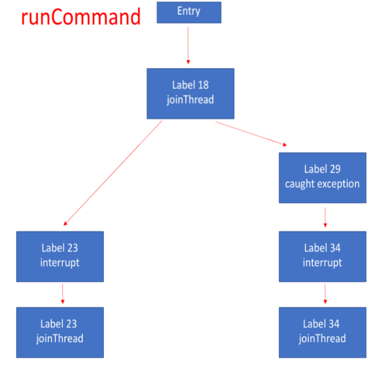

# About more findings on non-determinism of cflow

I have found a deeper reason for the non-deterministic feature of the original `cflow`: it is the **non-deterministic sequence of generating new taints**.

As I showed last time, the non-deterministic output paths are caused by the "unsorted" `successor`(the open list that contains taints, which is used in `dfs`) during the paths reconstruction stage.  To be specific, "unsorted" is caused by

* (1) the original sequence in `successor` is stochastic and 

* (2) the stable sort based on string representation of taint can't make `successor` sorted rigidly. 

Therefore, the exploration sequence of taints is non-deterministic, and it can cause different outputs when running `cflow` for several times.

I said reason (1) is due to the non-deterministic feature of `Soot` last time. Actually, after digging into `Soot`, I find that reason (1) is caused by **non-deterministic sequence of generating new taints** (So `Soot` should not be blamed). In that case, the successor of a taint may have random sequence before the sort. The non-deterministic sequence of generating new taints is caused by the following two reasons:

## 1. Non-deterministic sequence of analysis

Firstly, the sequence of analysis is non-deterministic. In original `cflow`, each analysis depends on both `method` and `entryTaint`(Can be viewed as context). In the iteration of analysis(the code is shown below), 

```java
while (changed) {
            changed = false;
            logger.info("iter {}", iter);

            for (SootMethod sm : methodList) {
                Body b = sm.retrieveActiveBody();
                Set<Taint> entryTaints = new HashSet<>();
                entryTaints.addAll(methodSummary.get(sm).keySet());
                for (Taint entryTaint : entryTaints) {
                    TaintFlowAnalysis analysis = new TaintFlowAnalysis(b, sourceSinkManager, entryTaint,
                            methodSummary, methodTaintCache, taintWrapper);
                    analysis.doAnalysis();
                    sinks.addAll(analysis.getSinks());
                    changed |= analysis.isChanged();
                }
            }

            iter++;
        }
```


`entryTaints` is a `HashSet` and is iterated over in
```
for (Taint entryTaint : entryTaints)
```

without any guarantee of sorting. Therefore, when `cflow` is run several times, the sequence of analysis for the same method in the same iteration may be different. 

This non-determinism can affect the sequence of taint generation. For example, for method `foo()` with two entry taints: `t1` on `r1.f1` and `r1.f2`(`f1` and `f2` are field reference on `r1`).

```
public void foo(Object) {
	Object r1,r2;
	r1 := @parameter0: Object;
	r2 = r1;
	return r2;
}
```

if the analysis on `foo()` with entry taint `t1` is first scheduled, then new taint on `r2.f1` will be generated first. Conversely, if the analysis on `foo()` with entry taint `t2` is first scheduled, then new taint on `r2.f2` will be generated first. Therefore, the sequence of taint generation is affected.


## 2. Non-deterministic sequence of propagating taint

When `cflow` is propagating taints from set `in` to  set `out`, it needs to iterate over taints in set `in` by

```java
for (Taint t : in)
```

Since `in` is a `HashSet`, this iteration does not guarantee the sorted sequence. 

In this case, the sequence of generating new taints is also non-deterministic.


Based on two reasons above, I can claim that `successor` of each taint is non-deterministic. (Note that this problem has nothing to do with `Soot`, since given a method body and its in-set, `Soot` will run a worklist algorithm and finally reach a deterministic fixed-point)

By the way, besides the `UniqueStmt` as I mentioned last time, I have tried different solutions to solve this problem. I try to use a `TreeSet` to build a sorted `successor`, but I find that it still needs more flow information. For example, in the control flow graph below, invoke statement at label 18 has the same string representation with invoke statement at label 34, and their hash code is non-deterministic(That is, hash code of the first statement may be bigger in the first run, but it may be smaller in the second run). So it cannot compare taints on those statements deterministically.




Therefore, I still use `UniqueStmt` to solve this problem of non-determinism, which is easy to implement and has an acceptable performance(Analysis time from 1 min 10 s in original `cflow` to 1 min 40 s after the revision).
