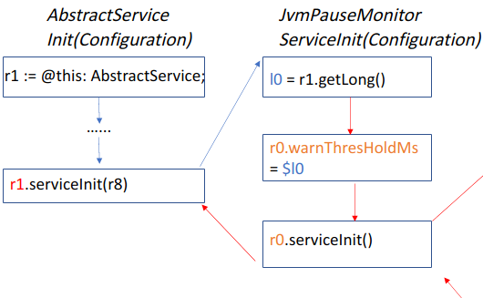

# Effect of implementing Points-to analysis

[toc]

I test the effect of points-to analysis and has only found 8 differences.

Here I have version `type_check` that can either check the declared type of variable or implement points-to analysis to check the type of object that the variable refers to.

I run command

```
$ ./run.sh -a hadoop_common -s
```

and 

```
$ ./run.sh -a hadoop_common -s
```

respectively. Where the first command does not run points-to analysis and the second command runs points-to analysis.

I then compare the analysis result of them.

**I find that there are 8 different taint paths**. 

As I analyze deeper, I find that they all have something to do with class `JvmPauseMonitor` and `AbstractService`. In fact,  `JvmPauseMonitor` is the subclass of `AbstractService`. And those paths all have a common sub-paths as shown in Figure 1. 



<div align = "center">Figure 1: Common sub-paths</div>

In Figure 1, blocks in the left column are statements in method `AbstractSevice: void Init(Configuration)` and blocks in the right column are statements in method `JvmPauseMonitor: void ServiceInit(Configuration)`; Blue arrows represent the direction of normal control flow and red arrows show the direction of taint flow. 

As is shown in Figure 1, in method `AbstractSevice: void Init(Configuration)`,  variable `r1` is declared as an instance of class `AbstractService`; Later, `r1` is the base object to invoke method `serviceInit`, whose declaring class is `JvmPauseMonitor`. 

Without points-to analysis, those sink paths are eliminated because static type check finds that `r1` should be an `AbstractService` type and thus the invoke to method `JvmPauseMonitor: void ServiceInit(Configuration)` is  unrealizable.

However, after points-to analysis, `cflow` finds that only statement 

```
virtualinvoke $r6.<org.apache.hadoop.util.JvmPauseMonitor: void init(org.apache.hadoop.conf.Configuration)>(r1) in <org.apache.hadoop.crypto.key.kms.server.KMSWebServer: void <init>(org.apache.hadoop.conf.Configuration,org.apache.hadoop.conf.Configuration)>
```

and

```
virtualinvoke r1.<org.apache.hadoop.util.JvmPauseMonitor: void init(org.apache.hadoop.conf.Configuration)>($r2) in <org.apache.hadoop.util.JvmPauseMonitor: void main(java.lang.String[])>
```

invokes method `AbstractSevice: void Init(Configuration)`, and the base object `r1` of those invoke statements are instance of `JvmPauseMonitor`. Therefore, it predicts that variable `r1` in method `AbstractSevice: void Init(Configuration)` refers to an object of `JvmPauseMonitor`. Thus this taint flow makes sense.

Actually, I spent much time implementing the points-to analysis, but only find one improvement. It seems that maybe my points-to analysis is not that context sensitive, or maybe `Hadoop` does not utilize many features of polymorphism. 

PLUS: Those 8 sink taints are shown below:

```
-- Sink $r2 in virtualinvoke r0.<org.apache.hadoop.util.Daemon: void setName(java.lang.String)>($r2) in method <org.apache.hadoop.util.Daemon: void <init>(java.lang.Runnable)> along
-- Sink $r3 in virtualinvoke $r3.<java.lang.Thread: void start()>() in method <org.apache.hadoop.util.JvmPauseMonitor: void serviceStart()> along:
-- Sink r0.<org.apache.hadoop.util.Daemon: java.lang.Runnable runnable> in virtualinvoke r0.<org.apache.hadoop.util.Daemon: void setName(java.lang.String)>($r2) in method <org.apache.hadoop.util.Daemon: void <init>(java.lang.Runnable)> along:
-- Sink r1.<org.apache.hadoop.util.JvmPauseMonitor$Monitor: org.apache.hadoop.util.JvmPauseMonitor this$0> in specialinvoke r0.<java.lang.Thread: void <init>(java.lang.Runnable)>(r1) in method <org.apache.hadoop.util.Daemon: void <init>(java.lang.Runnable)> along:
-- Sink $r2 in virtualinvoke r0.<org.apache.hadoop.util.Daemon: void setName(java.lang.String)>($r2) in method <org.apache.hadoop.util.Daemon: void <init>(java.lang.Runnable)> along:
-- Sink $r3 in virtualinvoke $r3.<java.lang.Thread: void start()>() in method <org.apache.hadoop.util.JvmPauseMonitor: void serviceStart()> along:
-- Sink r0.<org.apache.hadoop.util.Daemon: java.lang.Runnable runnable> in virtualinvoke r0.<org.apache.hadoop.util.Daemon: void setName(java.lang.String)>($r2) in method <org.apache.hadoop.util.Daemon: void <init>(java.lang.Runnable)> along:
-- Sink r1.<org.apache.hadoop.util.JvmPauseMonitor$Monitor: org.apache.hadoop.util.JvmPauseMonitor this$0> in specialinvoke r0.<java.lang.Thread: void <init>(java.lang.Runnable)>(r1) in method <org.apache.hadoop.util.Daemon: void <init>(java.lang.Runnable)> along:
```
